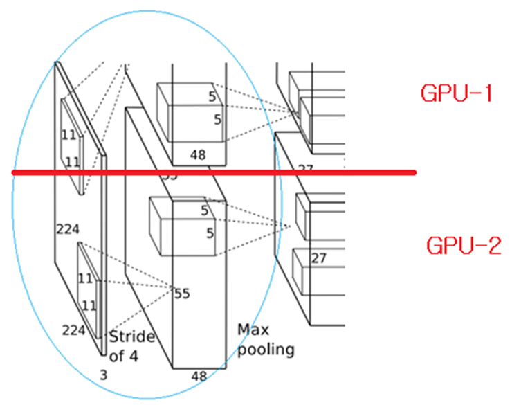
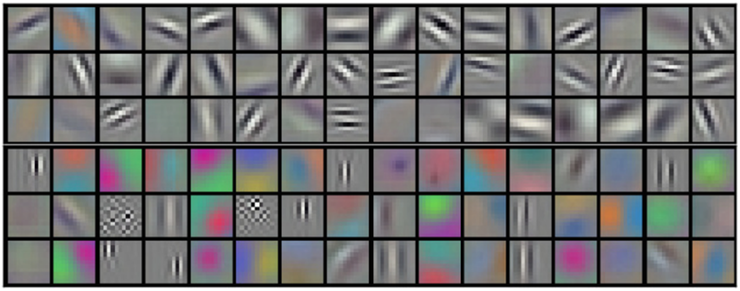
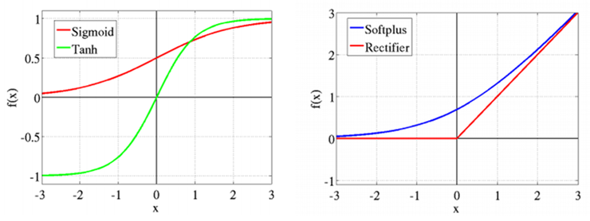
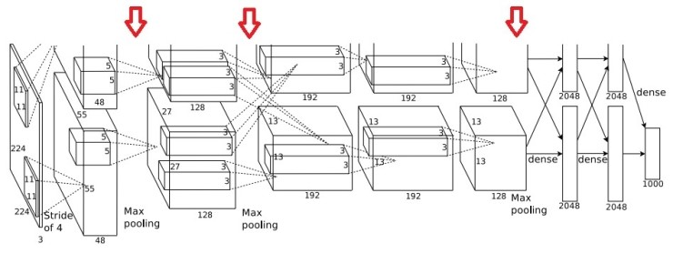
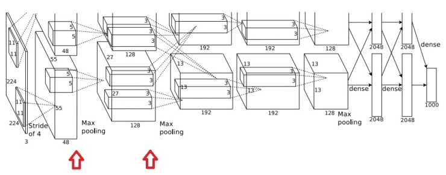
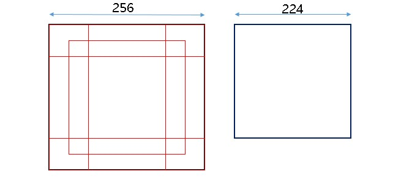
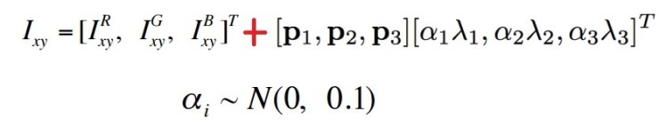
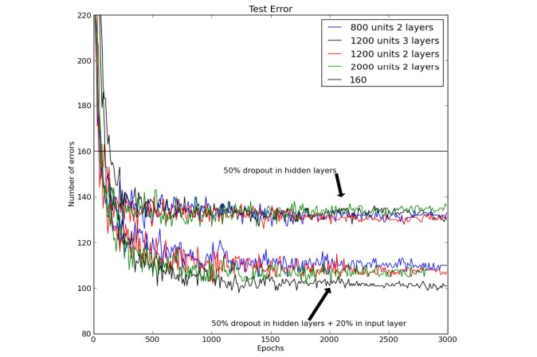
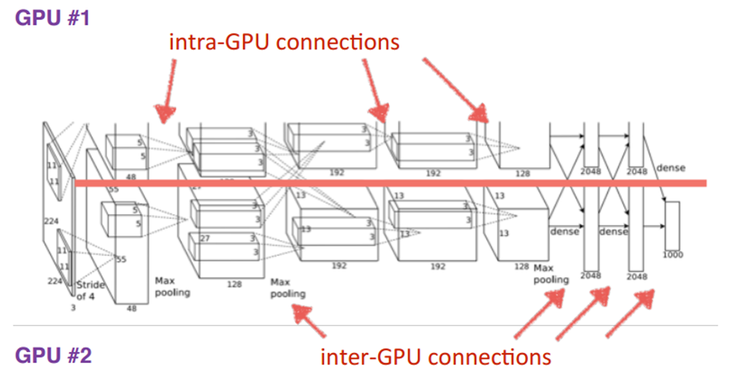
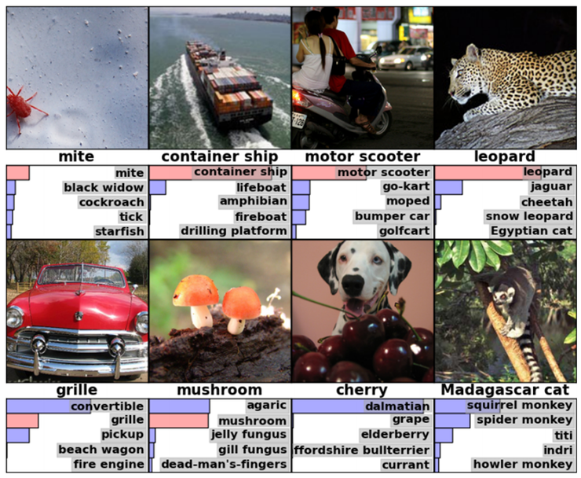

Convolutaion Neural Networks
=====================================
> 2017.07.25.  
> CNN 정리노트 3

---

## AlexNet

ImageNet 영상 데이터 베이스를 기반으로 한 "ILSVRC(ImageNet Large Scale Visual Recognition Challenge) - 2012" 우승은 캐나다의 토론토 대학이 차지한다.  
당시 논문의 첫번째 저자가 바로 Alex Khrizevsky이며, 그의 이름을 따, 그들이 개발한 CNN 구조를 AlexNet이라고 부른다.

AlexNet은 구조적 관점에서 보았을 때, LeCun의 LeNet5와 크게 다르지는 않지만, 높은 성능을 얻기 위해, 꽤 여러 곳에 상당한 고려가 들어가 있으며, 특히 GPU를 사용하여 매우 의미 있는 결과를 얻었기 때문에 이후 연구자들은 CNN 구조를 설계할 때 GPU를 사용하는 것이 대세가 되었다.

## AlexNet 의 구조

> AlexNet은 총 5개의 convolution layers와 3개의 full-connected layers로 구성이 되어 있으며, 맨 마지막 FC layer는 1000개의 category로 분류를 위해 활성 함수로 softmax 함수를 사용하고 있음을 알 수 있다.

AlexNet은 약 65만개의 뉴런, 6000만개의free parameter 및 6억3000만개의 connection으로 구성된 방대한 CNN구조를 갖고 있으며, 이렇게 방대한 망에 대한 학습을 위해 2개의 GPU를 사용하고 있다.  
당시에 사용한 GPU는 엔비디아 社에서 나온 GTX580을 사용했다.

GTX580은 3GB의 메모리를 갖고 있기 때문에, 망의 구조를 결정하는데도 3GB의 메모리 한계에 맞춰 하였다.

type        |patch size/stride  |   ouput size  | 비고
:-----------|:-----------------:|:-------------:|:-------------
input       |                   |   227x227x3   | 이미지 대회라서 RGB의 3 chanel
conv1       |   11x11x3/4       |   55x55x96    | 96개의 depth중 48개는 gpu1에 48개는 gpu2에 들어간다. 이후 모든 conv에서 같다.
pooling1    |   3x3/2           |   27x27x96    | MAX 사용
conv2       |   5x5/1           |   27x27x256   |
pooling2    |   3x3/2           |   13x13x256   | 이후 모든 pooling은 MAX
conv3       |   3x3/1           |   13x13x384   |
conv4       |   3x3/1           |   13x13x384   |
conv5       |   3x3/1           |   13x13x256   |
pooling3    |   3x3/2           |   6x6x256     |
FC1         |   2048,2048       |   2048,2048   | 4096 을 2개로 쪼갬
FC2         |   2048,2048       |   2048,2048   | 4096 을 2개로 쪼갬
FC3         |   2048,2048       |   1000        | Softmax

첫번째 convolutional layer를 거치게 되면, 96개의 feature-map을 얻을 수 있으며,

GPU-1에서는 주로 컬러와 상관없는 정보를 추출하기 위한 kernel이 학습이 되고,  
GPU-2에서는 주로 color에 관련된 정보를 추출하기 위한 kernel이 학습이 된다.  

## AlexNet 의 성능 개선을 위한 고려

AlexNet이 성능 향상을 위해 좀 더 고려한 부분은  
ReLU, overlapped pooling, response normalization, dropout 및 2개의 GPU 사용이라고 볼 수 있다.

### ReLU

앞서 신경망을 처음 설명하면서,  
신경망의 활성함수로는 biological neuron을 모델링하기 위한 nonlinear 활성함수로 sigmoid 함수를 사용한다는 것을 설명하였다. 하지만 sigmoid 함수는 hyperbolic-tangent 함수인 tanh에 비해서 학습 속도가 느리며, hyperbolic-tangent 함수 tanh 역시 학습 속도가 느린 문제가 있다. 망의 크기가 작을 때는 그 차이가 심각하지 않지만 말이다.

그래서 논문에서는 활성함수로 ReLU(Rectified Linear Unit)을 사용했다. 이는 전자공학에서 반파정류 회로와 비슷한 개념이며, 0에서 미분이 안 되는 문제가 있기는 하지만, 학습속도가 탁월하고 back-propagation 결과도 매우 단순하기 때문에 요즘 Deep Neural Network에서는 거의 ReLU를 선호하고 있다.

논문에서도 실제 실험 결과가 나오는데, 학습속도가 sigmoid나 tanh를 사용했을 때에 비해 학습 속도가 6배 정도 빨라지는 것을 볼 수 있다.

### Overlapped Pooling

CNN의 구조에서 일반적으로 pooling은 convolution을 통해 얻은 feature-map 영상의 크기를 줄이기 위한 용도로 사용하며, average pooling 또는 max pooling을 사용한다.  
* average pooling은 pooling window 내에 있는 픽셀들의 평균을 취하는 방식이고  
* max pooling은 window에서 최대값을 갖는 픽셀을 선택한다.  

max pooling은 average pooling에 비해 최대값을 구해야 하기 때문에 연산량이 더 많지만, 최대 크기를 갖는 자극만 전달한다는 관점에서 보면, 생물학적인 특성과 좀 더 유사하다고 볼 수 있다.  
LeNet-5에서는 average pooling 방식을 사용했지만, AlexNet에서는 max pooling을 사용하였으며, 아래 그림의 화살표 영역이 pooling layer에 해당된다.

통상적으로 pooling을 할 때는 겹치는 부분이 없게 하는 것이 대부분이며, pooling window의 크기도 2x2를 주로 사용하고, 건너뛰기(stride)도 2를 사용하기 때문에 출력 영상의 크기가 가로/세로 각각 1/2로 줄어들게 된다.  
하지만 AlexNet은 2x2 윈도우 대신 3x3 window를 선택하고, 건너 뛰기를 2로 하는 overlapped pooling 방식을 사용했다.

> 이 overlapped pooling 방식을 통해 top-1과 top-5 에러율을 각각 0.4%와 0.3% 줄일 수 있었으며, overfitting에 빠질 가능성도 더 줄일 수 있다고 주장을 하고 있다.

### Local Response Normalization

논문에서는 첫번째와 두번째 convolution을 거친 결과에 대하여 ReLU를 수행하고, max pooling을 수행하기에 앞서 response normalization을 수행하였다. 이를 통해 top-1과 top-5 에러율을 각각 1.4%와 1.2%를 개선하였다.

## Overfitting에 대한 해결책

> Data Augmentation

AlexNet에서는 작은 연산만으로 학습 데이터를 늘리는 2가지 방법을 적용하였다. 특히 GPU가 이전 이미지(학습 데이터)를 이용하여 학습하고 있는 동안에, CPU에서는 이미지를 늘리기 때문에 디스크에 저장할 필요가 없도록 하였다.

1.   
첫번째 방법은 ILSVRC의 256x256 크기의 원영상으로부터 무작위로 224x224 크기의 영상을 취하는 것이다. 이렇게 되면, 1장의 학습 영상으로부터 2048개의 다른 영상을 얻을 수 있다.

하지만 학습을 할 때는 5개의 224x224 영상(상하좌우 코너 및 중앙으로부터)과 그것들을 수평으로 반전한 이미지 5개, 총 10개로부터의 softmax 출력을 평균하는 방법으로 택하였다.

2.   
두번째 방법은 각 학습 영상으로부터 RGB 채널의 값을 변화시키는 방법을 택하였다. 이를 위하여 학습 이미지의 RGB 픽셀 값에 대한 주성분 분석(PCA)를 수행하였으며, 거기에 평균은 0, 표준편차는 0.1 크기를 갖는 랜덤 변수를 곱하고 그것을 원래 픽셀 값에 더해주는 방식으로 컬러 채널의 값을 바꾸어 다양한 영상을 얻게 되었다.

이렇게 data augmentation을 통하여 overfitting을 줄이고 top-1 error에 대하여 1% 이상 에러율을 줄일 수 있게 되었다.

3.  
Dropout에 대한 논문이 발표된 이래, 요즘 대부분의 CNN 구조에서는 Dropout을 적용하여 학습시간을 단축시키고 overfitting의 문제도 해결한다.

Dropout은 그 성격상 fully-connected layer에 대하여 행하기 때문에 AlexNet에서는 fully connected layer의 처음 2개 layer에 대해서만 적용을 하였다. 또한 dropout의 비율은 50%를 사용하였다.

Hinton이 첫번째 저자로 발표한 2012년의 논문 “Improving neural networks by preventing co-adaptation of feature detectors” 논문도 한번 살펴보면 좋을 것 같다.   
아래의 그림은 Hinton의 논문에서 dropout을 hidden layer에 대해서만 적용할 때와 입력단과  hidden layer 양쪽에 dropout을 적용했을 때를 비교한 것이다.

## AlexNet에서의 GPU 활용

AlexNet은 2개의 GPU를 사용하였다. 당시는 GTX580 GPU를 사용했는데, 지금은 더 고성능의 GPU들이 더 많이 나와있으며, 8개 이상의 GPU를 사용하는 연구들도 많이 볼 수 있다.  
AlexNet 개발 당시 사용한 GTX580은 3GB의 메모리를 갖고 있었기 때문에 모델의 구조에 제약이 있을 수밖에 없어 보인다.   
이는 그때 당시 학교에서 진행하는 연구였기 때문에 쉽게 구할 수 있는 플랫폼을 선택했을 것으로 추정하며, 2개의 GPU를 사용하는 구조를 설계하면서 많은 고민이 있었을 것으로 보인다.  
또한 제한된 플랫폼이기 때문에 GPU를 위/아래로 나눠쓰는 방식을 취했지만, 이후 연구들에서는 이런 식의 구조를 취한 사례가 별로 없다. 이는 더 고사양의 플랫폼을 쓰면 되기 때문인 것으로 추정된다.  
아래 그림은 AlexNet의 구조를 GPU 사용의 관점에서 본 것이다.

AlexNet 연구자들은 2개의 GPU를 사용하여, 1개의 GPU를 사용했을 때보다 top-1과 top-5에러를 각각 1.7%와 1.2% 절감할 수 있었다고 주장을 하고 있다.  

## AlexNet - 결과

AlexNet의 실험 결과를 보면, 아래 그림처럼, 상당히 결과가 괜찮은 것을 알 수가 있다.  
그림에서 올바른 결과는 그림 바로 밑에 적혀 있고, 그 밑에 있는 5개의 후보는 AlexNet이 추정한 것이다.  

이런 결과가 SIFT(Scale Invariant Feature Transform)와 같은 feature extractor를 사용하지 않고, CNN 학습을 통해서 얻어진 결과라는 점이 더욱 고무적이다.  
2012년의 대회에서 실제로 SIFT 등을 사용한 다른 참가자들의 경우, 성능이 떨어졌다. 이는 CNN을 아주 복잡한 일반 영상에 대해서도, 학습의 양이 충분하다면, 그리고 좋은 CNN 구조를 갖는다면, 충분히 좋은 결과를 낼 수 있다는 가능성을 보여줬다는 점에서 매우 큰 의미를 갖는 것 같다.   