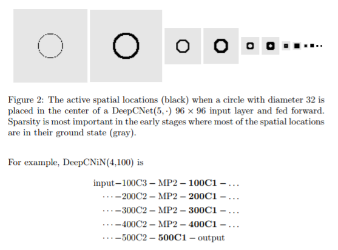
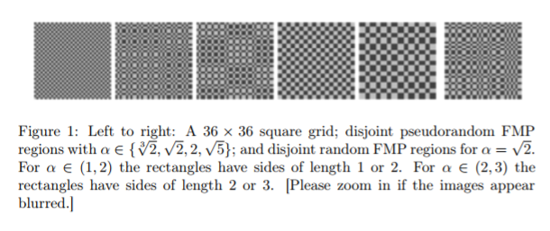
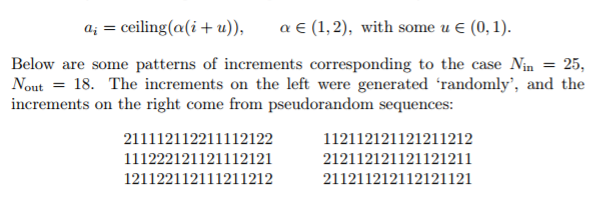

# 해당 문서는

`CIFAR` 데이터를 이용해한 Image Classification 을 공부하면서 만든 파일입니다.  
AlexNet


Result  |   Method  |   따라해보기    
--------|-----------|--------------
75.72%  | [Spatially-sparse convolutional neural networks](https://arxiv.org/abs/1409.6070) | [CIFAR-100 [DeepCNiN(4,100)] 54.6%.ipynb]()  
73.61%  | [Fractional Max-Pooling](https://arxiv.org/abs/1412.6071) | [CIFAR-100 [FracionalMP] 49.2%.ipynb]()

--- 

### Spatially-sparse convolutional neural networks  

> `Spatially-sparse`이란 말 그대로 sparse 데이터를 이미지 주변에 Padding한다.   

  

1. CNN을 통한 images classification에서 일반적으로 이미지를 전처리해서 input으로 넣는다.  가장 대표적인게 RGB 체널이 `0~255`값을 갖는데 이것을 `0~1`값으로 바꿔 넣는다.  
하지만 이 논문에서는 `-1~1` 값을 가지게 한다. 이 상태에서 zero-padding을 하게되면, image 주변에 검은색 패딩을 하는 것이 아니라 회색 패딩을 하게된다.   

<br>

2. 일반적인 CNN 구조에서 Conv layer는 [3, 3] filter를 갖는다. 이 논문에서는 Network in Network(NiN) 개념을 가지고 와서 `Conv2-MP2-Conv1`과 같은 구조를 나열해서 사용한다.  

<br>

3. DeepNiN(l, k) 라는 구조를 사용하는데, 만약 DeepNiN(4, 10) 라면 다음과 같은 구조를 갖는다.  그리고 leaky(1/3)-ReLU를 사용한다.
```
10Conv3-MP2-10Conv1
20Conv2-MP2-20Conv1
30Conv2-MP2-30Conv1
40Conv2-MP2-40Conv1
50Conv2-50Conv1
```

<br>

4. Input size는 3x2^l 로 만들어야한다.  DeepNiN(5, 100) 의 구조를 사용한다면 `3x2^5 = 96`(논문에서 사용함) 로 만들어주어야 하고, DeepNiN(4, 100) 의 구조를 사용한다면 `3x2^4 = 48`(필자 사용) 사이즈로 zero-padding 해주면 된다.  


---

### Fractional Max-Pooling

> `Fractional`이란 말처럼 Max-Pooling에서 filter크기가 `1 < a < 2` 값을 갖는다.  

  

1. filter size가 실제 소수값을 갖는것이 아니라 a = {1, 2} 값을 랜덤하게 갖는다.  
* 먼저 `pooling_ratio`를 정해야한다. 일반적으로 √2 값을 주는데, Input_size=10 라면 Output_size는 `ceiling(25/√2)=7` 이 된다.  
* 이제 sequences 하게 {1, 2}를 합해서 25가 되도록 18개를 뽑는다.  
    * e.g. i = 1211212 | j = 2212111
    * A_i = [0 1 3 4 5 7 8 10]
    * B_j = [0 2 4 5 7 8 9 10]
* 2번을 뽑게 되는데 하나는 row_pooling_sequence(A_i)가 되고 하나는 col_pooling_sequence(B_j)가 된다.

<br>

2. Pooling regions는 P_ij = [A_{i-1}, A_i - 1] x [B_{j-1}, B_j - 1] 가 되는데,  
* i=j=1 인 경우를 살펴보면, [1 x 2] 크기의 filter size를 갖게된다.  
원소가 {1, 2}를 가지므로 [1 x 1], [1 x 2], [2 x 1], [2 x 2]의 filter size를 가질 수 있다. 

<br>

3. overlapping 이라는 옵션이 있는데, Pooling regions이 P_ij = [A_{i-1}, A_i] x [B_{j-1}, B_j] 가 되서 region의 우하단 부분이 겹치게 할 수도 있다.  
CIFAR100 test의 경우 무조건 overlapping 이 좋은 결과가 나온다.
* Conv[3x3 / str=1]을 생각하면 쉽다.  
4. sample 방식이 2개가 있는데 `Random` 과 `Pseudo random` 를 선택할 수 있다.
그 차이는 미묘하나 CIFAR100 기준으로 test를 1번한 것은 pseudo 가 좋고 12번 돌린 test는 random이 좋다고 한다.
* pseudo의 경우 값이  stable하게 나오는 강점이 있는데 이거 오히려 12번돌린경우 random하게 뽑은 unstable 의 앙상블이 더 좋은 결과를 만들어내는 효과가 있는것 같다. 



[Fractional MP 예제코드](https://github.com/Park-Ju-hyeong/ConvNet/blob/master/CIFAR/FractionalMP_.ipynb)

<br>

5. Francional Max-Pooling의 모형 구조는 다음과 같다. 
`(32nC2 − FMP√2)5 − C2 − C1 − output`

<br>

---

## 요구되는

[Tensorflow](https://www.tensorflow.org/) An open-source software library for Machine Intelligence  
```pip install tensorflow-gpu```   


## Reference

[Hvass-Labs](https://github.com/Hvass-Labs/TensorFlow-Tutorials)