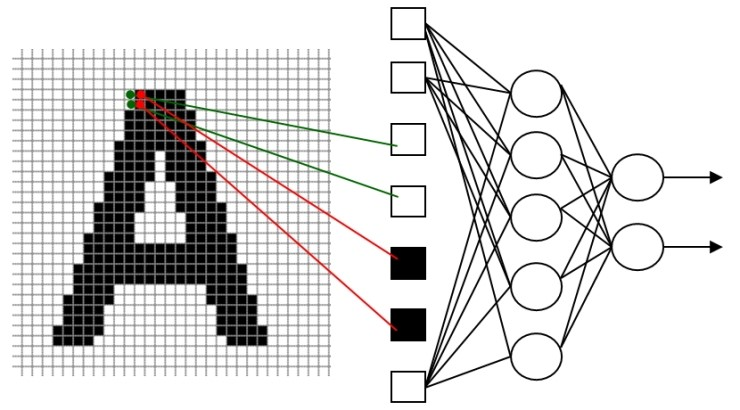
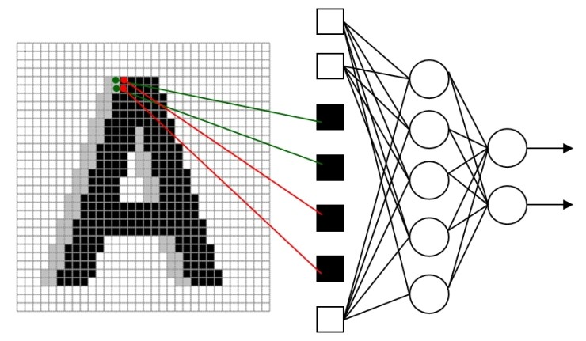

# Convolutaion Neural Networks

> 2017.07.25.

##  CNN의 역사

CNN 은 1989년 LeCun이 발표한 논문("Backpropagation applied to handwritten zip code recognition")에서 처음 소개가 되었고, 필키체 zip code 인식을 위한 프로젝트를 통해 개발이 되었다.

## 기존 Multi-layer Neural Network의 문제점

이상적인 머신러닝 시스템이라면, 학습 데이터만 적절하게 많이 넣어주면 알아서 분류까지 해주는 것을 기대할 것이다.

기존의 신경망은 아래 그림처럼 전체 글자에서 단지 2픽셀값만 달라지거나 2픽셀씩 이동만 하더라고 새로운 학습 데이터로 처리를 해줘야 하는 문제점이 있다.

또한 글자의 크기가 달라지거나, 글자가 회전되거나, 글자에 변형이 조금만 생겨도 새로운 학습 데이터를 넣어주지 않으면 좋은 결과를 기대하기 어렵다.

> 글자의 topology는 고려하지 않고, 말 그대로 raw data에 대해 직접적인 처리를 하기 때문에 엄청나게 많은 학습 데이터를 필요로 하고, 그 cost를 지불해야 한다.

## 왜 CNN 인가?

### Receptive Field

> 정보처리와 관계되는 세포에 대해 응답을 일으키는 자극의 영역. 감각기의 수용 표면에서 감각자극이 단일감각신경에 반응, 즉 충격발생을 일으키는 영역이다. 특히 눈의 망막면 광자극에 관계되는 것을 말하며, 개구리 망막에서 미세조사법을 이용한 연구결과에 의해 명명된 용어이다. 넓이는 자극광 강도에 의존하고 역자극은 가장 민감한 중앙의 작은 부분에 한정되지만, 그 102~103배 강도에서는 2배 면적(1mm)으로 확대된다.

즉, 수용영역이란 위부 자극이 전체 영향을 끼치는 것이 아니라 특정 영역에만 영향을 준다는 것이다.

마찬가지로 영상에서의 특정 위치레 있는 픽셀들은 그 주변에 있는 일부 픽셀들과만 correlation이 높을 뿐이며, 거리가 멀어지면 멀어질수록 그 영향은 감소하게 된다.  
"인식 알고리즘"을 수행하고자 할 경우 영상 전체 영역에 대해 서로 동일한 연관성으로 처리하는 대신에 특정 범위에 한정해 처리를 한다면 훨씬 효과적일 것이라는 것을 미루어 짐작할 수 있다.

이런 아이디어에 기반하여 출현을 한 것이 바로 CNN이다.

### Convolution 이란?

아래의 예를 보면, 왼쪽의 전체 이미지에서 노란색 부분이 현재 convolution이 일어나고 있는 영역이며, 빨간색 글자는 convolution의 kernel에 해당이 되고, 노란색 영역의 mask에 대해 연산을 수행하면, 결과는 오른쪽처럼 4가 나오며, 노란색 윈도우 영역을 오른쪽으로 1을 이동시켜 다시 결과를 구하면 3이 되며, 계속 이동을 시키면서 연산을 하면 최종적인 결과를 얻을 수 있다.

## CNN의 특징

### Locality

CNN은 recptive field와 유사하게 local 정보를 활용한다. 공간적으로 인접한 신호들에 대한 correlation관계를 비선형 필터를 적용하여 추출해 낸다. 이런 필터를 여러 개를 적용하면 다양한 local특징을 추출해 낼 수 있게 된다.
 subsampling 과정을 거치면서 영상의 크기를 줄이고 local feature들에 대한 filter 연산을 반복적으로 적용하면 점차 global feature를 얻을 수 있게된다.

 ### Shared Weights

 Convolution의 개년을 설명할 때 보았던 것처럼, 동일한 계수를 갖는 filter를 전체 영상에 반복적으로 적용함으로 변수의 수를 획기적으로 줄일 수 있으며, topology 변화에 무관한 항상성(invariace)를 얻을 수 있게된다.

 ## CNN 구조

 

 CNN의 과정은 크게 보면 다음과 같은 3단계 과정으로 이루어 진다.

1. 특징을 추출하기 위한 단계
2. topology 변화에 영향을 받지 않도록 해주는 단계
3. 분류기 단계

CNN 처리 과정은 단순하게 분류기로 구성되있는 것이 아니라, 특징을 추출하기 단계가 내부에 포함이 되어 있기 때문에 raw image에 대해 직접 operation이 가능하며, 기존 알고리즘과 달리 별도의 전처리단계를 필요로 하지 않는다.   
특징 추출과 topology invariance를 얻기 위해 filter와 subsampling을 거치며, 보통 이 과정을 여러 번을 반복적으로 수행하여 local feature로부터 global feature를 얻어낸다.  
분류기 단계는 학습을 통해 다양한 경우에 대응할 수 있도록 해주는 것이 목표이며, 기존 신경망과 동일한 구조를 갖는다.

 

 아래의 예에서 max-pooling을 선택하게 되면, 전체 subsampling 윈도우에서 가장 큰 값만 선택하기 때문에 우 상단에 있는 값처럼 결과가 나오고, average-sampling을 선택하면 각 window의 평균을 취하기 때문에 우 하단에 있는 결과가 나온다.  

이동이나 변형 등에 무관한 학습 결과를 보이려면 좀 더 강하고 global한 특징을 추출해야 하는데, 이를 위해 통상적으로 (convolution + sub-sampling) 과정을 여러 번을 거치게 되면 좀 더 전체 이미지를 대표할 수 있는 global한 특징을 얻을 수 있게 된다.  
이렇게 얻어진 특징을 fully-connected network을 통해 학습을 시키게 되면 2차원 영상 정보로부터 receptive field와 강한 신호 선택의 특성을 살려 topology 변화에 강인한 인식 능력을 갖게 된다

위 그림은 CNN의 구조를 성명하는 대표적인 그림 중 하나이다.

## Hyper-parameters

### Filter의 개수

Feature map의 크기(즉, convolutional layer의 출력 영상의 크기)는 layer의 depth가 커질수록 작아지기 때문에, 일반적으로 영상의 크기가 큰 입력단 근처에 있는 layer는 filter의 개수가 적고 입력단에서 멀어질수록 filter의 개수는 증가하는 경향이 있다.  

* Tc = Np x Nf x Tk
    * Tc: 각 layer에서의 연산시간
    * Np: 출력 pixel의 수
    * Nf: 전체feature map의 개수
    * Tk: 각 filter 당 연산 시간

필터의 개수를 정할 때 흔히 사용하는 방법은 각 단에서의 연산 시간/량을 비교적 일정하게 유지하여 시스템의 균형을 맞추는 것이다.  
보통 pooling layer를 거치면서 2x2 sub-sampling을 하게 되는데, 이렇게 되면  convolutional layer 단을 지날 때마다, pixel의 수가 1/4로 줄어들기 때문에 feature map의 개수는 대략 4배 정도로 증가시키면 될 것이라는 것은 감을 잡을 수가 있을 것이다.

### Filter의 형태

일반적으로 32x32나 28x28과 같은 작은 크기의 입력 영상에 대해서는 5x5 필터를 주로 사용을 하지만 큰 크기의 자연 영상을 처리할 때나 혹은 1 단계 필터에 11x11이나 15x15와 같은 큰 크기의 kernel을 갖는 필터를 사용하기도 한다.

그렇다면, 큰 kernel 크기를 갖는 필터 1개을 사용하는 것이 좋을까?  
아니면 작은 크기를 갖는 filter 여러 개를 중첩해서 사용하는 것이 좋을까?  

결론부터 말하자면, 결과는 여러 개의 작은 크기의 필터를 중첩해서 사용하는 것이 좋다.  이는 작은 필터를 여러 개 중첩하면 중간 단계에 있는 non-linearity를 활용하여 원하는 특징을 좀 더 돋보이도록 할 수 있기 때문이다. 뿐만 아니라, 작은 필터를 여러 개 중첩해서 사용하는 것이 연산량도 더 적게 만든다.

### Stride 값

Stride는 convolution을 수행할 때, 건너 뛸 픽셀의 개수를 결정한다. 쉽게 설명하기 위해, 1차원의 경우를 예를 들면 아래 그림과 같다.

위 그림처럼, stride는 건널 뛸 픽셀의 수를 나타내며, 2차원인 영상 데이터에 대해서는 가로 및 세로 방향으로 stride에서 정한 수만큼씩 건너 뛰면서  convolution을 사용한다.

Stride는 입력 영상의 크기가 큰 경우, 연산량을 줄이기 위한 목적으로 입력단과 가까운 쪽에만 적용을 한다.

#### 그럼 stride를 1로 정하고, pooling을 적용하는 방식과 stride 값을 크게 하는 방식에는 어떤 차이가 있을까?

Stride를 1로 하면, 경계가 아닌 모든 입력 영상에 대해 convolution 연산을 수행하고 pooling을 하면서 값을 선택적으로 고를 수가 있지만, stride를 크게 하면 그런 선택의 기회가 사라지게 된다.   

그러므로 통상적으로 보았을 때는 stride를 1로 하고, pooling을 통해 적절한 sub-sampling 과정을 거치는 것이 결과가 좋다.

하지만 Krizhevsky의 논문처럼, 큰 영상에 대해 CNN을 적용하는 경우는 연산량을 줄이기 위해 입력 영상을 직접적으로 처리하는 1단계 convolutional layer에서는 stride 값을 1이 아닌 값을 적용하기도 한다.

### Zero-padding 지원 여부

아래 그림은 유명한 LeCun의 논문에 나오는 CNN의 구조를 보여준다.

보통 convolution 연산을 하게 되면, 경계 처리문제로 인해 출력 영상인 feature map의 크기가 입력 영상보다 작아지게 된다.  
zero-padding은 작아지는 것을 피하기 위해 입력의 경계면에 0을 추가하는 것을 말하며, FFT 등에서도 많이 사용이 된다.

만약에 입력 영상의 경계에 0을 2 픽셀씩 추가하여 36x36 크기의 영상을 만들었다면
feature map의 크기는 32x32가 된다. 이렇게 zero-padding을 지원하면 영상 크기를 동일하게 유지할 수 있다. 

그럼 zero-padding을 하는 이유는 무엇일까?   
단순하게 영상의 크기를 동일하게 유지하는 장점 이외에도, 경계면의 정보까지 살릴 수가 있어 zero-padding을 지원하지 않는 경우에 비해 zero-padding을 지원하는 것이 좀 더 결과가 좋다.