Convolutaion Neural Networks
=====================================
> 2017.07.25.  
> CNN 정리노트 4

<!-- TOC -->

- [GoogLeNet](#googlenet)
- [NIN(Network In Network) 구조와 설계 철학](#ninnetwork-in-network-구조와-설계-철학)
- [1x1 Convolution이란?](#1x1-convolution이란)
- [구글의 인셉션(Inception)](#구글의-인셉션inception)
- [GoogleLeNet의 핵심 철학 및 구조](#googlelenet의-핵심-철학-및-구조)
- [AlexNwt과의 비교](#alexnwt과의-비교)
- [Auxiliary classifier](#auxiliary-classifier)
- [Factorizing Convolutions](#factorizing-convolutions)
- [Convolution Neural Network](#convolution-neural-network)
    - [효과적으로 해상도(grid size)를 줄이는 방법](#효과적으로-해상도grid-size를-줄이는-방법)
- [Inception-V2](#inception-v2)

<!-- /TOC -->
---

## GoogLeNet

GoogLeNet에서는 망의 깊이 및 넓이가 모두 커지고, 중간에 분기되는 부분도 있고, “인셉션”이라는 생소한 모듈이 등장한다. 하지만, 이 모든 것들이 구글의 연구팀들이 최초로 개발한 것은 아니며, 이들 역시 타 연구자들의 연구와 자신들의 연구를 융합하여 발전시킨 결과이다.  
구글은 자신들의 구조를 설계함에 있어 크게 2개의 논문을 참조하고 있으며, 그 중 인셉션 모듈 및 전체 구조에 관련된 부분은 싱가포르 국립 대학의 “Min Lin”이 2013년에 발표한 “Network In Network” 구조를 더욱 발전 시킨 것이다.

## NIN(Network In Network) 구조와 설계 철학  

NIN은 말 그대로 네트워크 속의 네트워크를 뜻한다.

NIN 설계자는 CNN의 convolutional layer가 local receptive field에서 feature를 추출해내는 능력은 우수하지만,  filter의 특징이 linear하기 때문에 non-linear한 성질을 갖는 feature를 추출하기엔 어려움이 있으므로, 이 부분을 극복하기 위해 feature-map의 개수를 늘려야 하는 문제에 주목했다. 필터의 개수를 늘리게 되면 연산량이 늘어나는 문제가 있다.

그래서 NIN 설계자는 local receptive field 안에서 좀 더 feature를 잘 추출해낼 수 있는 방법을 연구하였으며, 이를 위해 micro neural network를 설계하였다. 이들은 convolution을 수행하기 위한 filter 대신에 MLP(Multi-Layer Perceptron)를 사용하여 feature를 추출하도록 하였으며, 그 구조는 아래 그림과 같다.

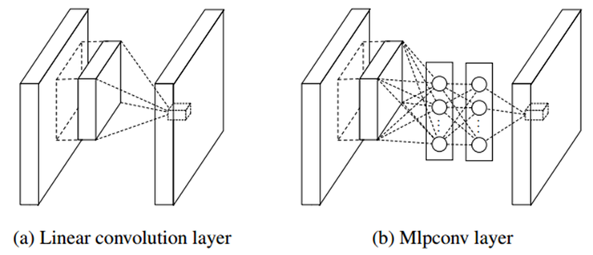

CNN은 filter의 커널을 입력 영상의 전체 영역으로 stride 간격만큼씩 옮겨가면서 연산을 수행한다. 반면에 NIN에서는 convolution 커널 대신에 MLP를 사용하며, 전체 영역을 sweeping 하면서 옮겨가는 방식은 CNN과 유사하다.

MLP를 사용했을 때의 장점은 convolution kernel 보다는 non-linear 한 성질을 잘 활용할 수 있기 때문에 feature를 추출할 수 있는 능력이 우수하다는 점이다. 또한 1x1 convolution을 사용하여 feature-map을 줄일 수 있도록 하였으며, 이 기술은 GoogLeNet의 인셉션에 그대로 적용이 된다.

NIN 이름이 붙은 이유는 망을 깊게 만들기 위해, mlpconv layer를 여러 개를 쌓아 사용을 하기 때문이며, 그래서 네트워크 안에 네트워크가 있다는 개념이 만들어지게 되었다. GoogLeNet에서도 인셉션 모듈을 총 9개를 사용하기 때문에 개념적으로는 NIN과 맥이 닿아 있다고 볼 수 있다.

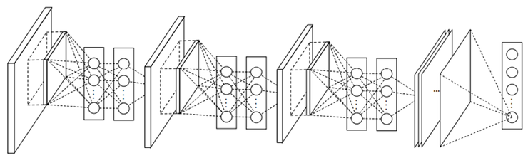

NIN 구조가 기존 CNN과 또 다른 점은 CNN의 최종단에서 흔히 보이는  fully-connected neural network이 없다는 점이다. (위 그림 참조)  
Fully-connected NN 대신에 최종단에 “Global average pooling”을 사용하였다. 이는 앞에서 효과적으로 feature-vector를 추출하였기 때문에, 이렇게 추출된 vector 들에 대한 pooling 만으로도 충분하다고 주장을 하고 있다. Average pooling 만으로 classifier 역할을 할 수 있기 때문에 overfitting의 문제를 회피할 수 있고, 연산량이 대폭 줄어드는 이점도 얻을 수 있다.

## 1x1 Convolution이란?

Convolution은 local receptive field의 개념을 적용하기 때문에 7x7, 5x5, 3x3과 같이 주변 픽셀들의 정보를 같이 활용을 한다. 그런데 괴상한(?) 이름의 1x1 convolution 이라는 개념이 나온다.   
1x1 convolution을 하는 결정적인 이유는 차원을 줄이는 것이다. GoogLeNet 소개 논문에 나오는 것처럼, Hebbian principle(Neurons that fire together, wire together)에 의해 차원의 줄일 수 있다.   
1x1 convolution을 수행하면, 여러 개의 feature-map으로부터 비슷한 성질을 갖는 것들을 묶어낼 수 있고, 결과적으로 feature-map의 숫자를 줄일 수 있으며, feature-map의 숫자가 줄어들게 되면 연산량을 줄일 수 있게 된다. 또한 연산량이 줄어들게 되면, 망이 더 깊어질 수 있는 여지가 생기게 된다.

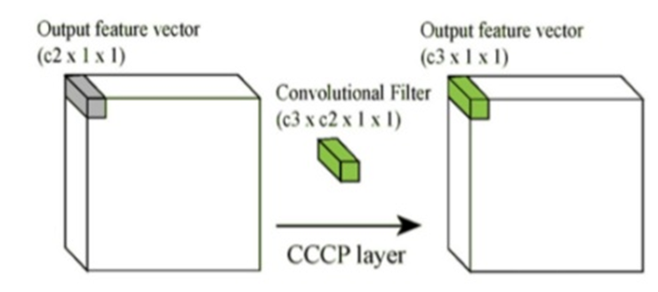

위 그림에서 “C2 > C3”의 관계가 만들어지면, 차원을 줄이는 것과 같은 효과를 얻을 수 있기 때문에, GoogLeNet을 포함한 최신 CNN 구조에서는 1x1 convolution을 많이 사용한다.

1x1 convolution은 처음에는 개념적으로 쉽게 와닿지 않는다. 논문이나 설명 글을 참고할 때 1x1 convolution을 1-layer fully-connected neural network이라고도 하는데, 그 이유는 1x1 convolution이 fully-connected와 동일한 방식이기 때문이다.  
만약에 입력 feature-map c2의 갯수가 4이고, 출력 feature-map c3의 갯수가 2인 경우를 가정해보면, 1x1 convolution은 아래 그림과 같이 표현할 수 있다.

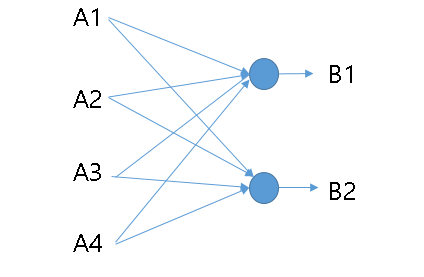

결과적으로 보면 4개의 feature-map으로부터 입력을 받아, 학습을 통해 얻어진 learned parameter를 통해 4개의 feature-map이 2개의 feature-map으로 결정이 된다. 즉, 차원이 줄어들게 되며, 이를 통해 연산량을 절감하게 된다.   
또한, neuron에는 활성함수로 RELU를 사용하게 되면, 추가로 non-linearity를 얻을 수 있는 이점도 있다.

## 구글의 인셉션(Inception)

원래 1x1 convolution, 3x3 및 5x5 convolution, 3x3 max pooling을 나란히 놓는 구조를 고안하였다. 다양한 scale의 feature를 추출하기에 적합한 구조가 된다.  
하지만 곧 문제에 부딪치게 된다. 3x3과 5x5 convolution은 연산량의 관점에서 보면, expensive unit(값 비싼 대가를 치러야 하는 unit)이 된다.  
망의 깊이가 깊지 않을 때는 큰 문제가 아니나, 망의 깊이와 넓이가 깊어지는 GoogLeNet 구조에서는 치명적인 결과가 될 수도 있다.

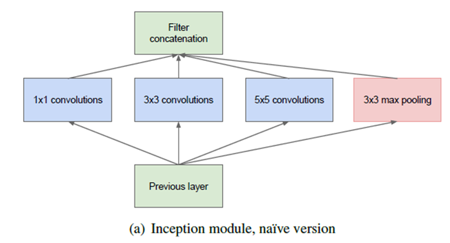

그래서 아래의 그림과 같이 3x3 convolution과 5x5 convolution의 앞에, 1x1 convolution을 cascade 구조로 두고, 1x1 convolution을 통해 feature-map의 개수(차원)를 줄이게 되면, feature 추출을 위한 여러 scale을 확보하면서도, 연산량의 균형을 맞출 수 있게 된다.  
GoogLeNet의 22 layer까지 깊어질 수 있는 것도 따지고 보면, 1x1 convolution을 통해 연산량을 조절할 수 있었기 때문에, 이렇게 깊은 수준까지 망을 구성할 수 있게 된 것이다.  
3x3 max pooling에 대해서도 1x1 convolution을 둔다.

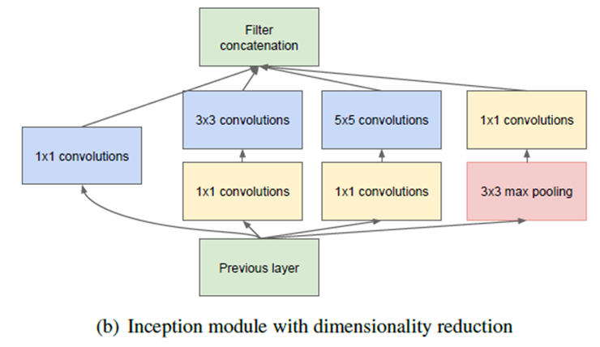

NIN에서는 MLP를 이용하여 non-linear feature를 얻어내는 점에 주목을 했지만, MLP는 결국 fully-connected neural network의 형태이고, 구조적인 관점에서도 그리 익숙하지 못하다.  
반면에 구글은 기존의 CNN 구조에서 크게 벗어나지 않으면서도 효과적으로 feature를 추출할 수 있게 되었다. 요약하면, 인셉션 모듈을 통해 GoogLeNet 은 AlexNet에 비해 망의 깊이는 훨씬 깊은데 free parameter의 수는 1/12 수준이고 전체 연산량도 AlexNet에 비해 적다는 것을 알 수가 있다.  
참고로 GoogLeNet에는 총 9개의 인셉션 모듈이 적용되어 있다.

## GoogleLeNet의 핵심 철학 및 구조

GoogLeNet 의 핵심 설계 철학은 주어진 하드웨어 자원을 최대한 효율적으로 이용하면서도 학습 능력은 극대화 할 수 있도록 깊고 넓은 망을 갖는 구조를 설계하는 것이다.
인셉션 모듈에 있는 다양한 크기의 convolution kernel(그림에서 파란색 부분)을  통해 다양한 scale의 feature를 효과적으로 추출하는 것이 가능해졌다. 또한 인셉션 모듈 내부의 여러 곳에서 사용되는 (위 그림의 노란색 부분) 1x1 convolution  layer를 통해, 연산량을 크게 경감시킬 수 있게 되어, 결과적으로 망의 넓이와  깊이를 증가시킬 수 있는 기반이 마련 되었다. 이 인셉션 모듈을 통해 NIN (Network-in-Network) 구조를 갖는 deep CNN 구현이 가능하게 되었다.

GoogLeNet에는 아래 그림과 같이, 총 9개의 인셉션 모듈이 적용이 되었다. 그림에서 빨간색 동그라미가 인셉션 모듈에 해당이 된다. 망이 워낙 방대하여 작은 그림으로 표현하기에 아쉬움이 있다.

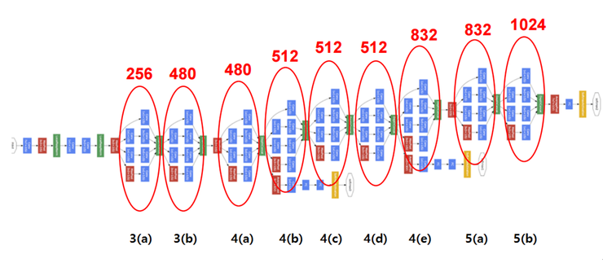

위 그림에서 
* 파란색 유닛은 convolutional layer
* 빨간색은 max-pooling 유닛
* 노란색 유닛은 Softmax layer
* 녹색은 기타 function  

인셉션 모듈을 나타내는 동그라미 위에 있는 숫자는 각 단계에서 얻어지는 feature-map의 수를 나타낸다.

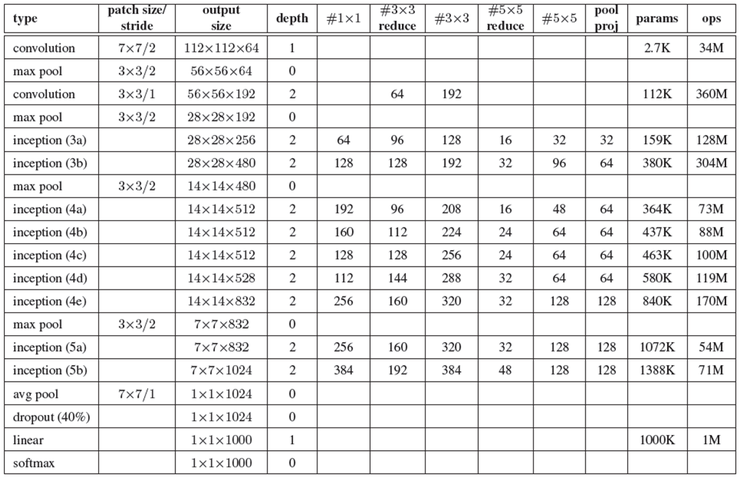

GoogLeNet의 각 layer의 구조는 위 표와 같다. 위 표는 얼핏 보기에는 복잡해 보이지만, 조금만 살펴보면 그 내용을 정확하게 이해할 수 있다.

l  Patch size/stride: 커널의 크기와 stride 간격을 말한다. 최초의 convolution에 있는 7x7/2의 의미는 receptive field의 크기가 7x7인 filter를 2픽셀 간격으로 적용한다는 뜻이다.

l  Output size: 얻어지는 feature-map의 크기 및 개수를 나타낸다. 112x112x64의 의미는 224x224 크기의 이미지에 2픽셀 간격으로 7x7 filter를 적용하여 총 64개의 feature-map이 얻어졌다는 뜻이다.

l  Depth: 연속적인 convolution layer의 개수를 의미한다. 첫번째 convolution layer는 depth가 1이고, 두번째와 인셉션이 적용되어 있는 부분은 모두 2로 되어 있는 이유는 2개의 convolution을 연속적으로 적용하기 때문이다.

l  #1x1: 1x1 convolution을 의미하며, 그 행에 있는 숫자는 1x1 convolution을 수행한 뒤 얻어지는 feature-map의 개수를 말한다. 첫번째 인셉션 3(a)의 #1x1 위치에 있는 숫자가 64인데 이것은 이전 layer의 192개 feature-map을 입력으로 받아 64개의 feature-map이 얻어졌다는 뜻이다. 즉, 192차원이 64차원으로 줄어들게 된다.

l  #3x3 reduce: 이것은 3x3 convolution 앞쪽에 있는 1x1 convolution 을 의미하여 마찬가지로 인셉션 3(a)의 수를 보면 96이 있는데, 이것은 3x3 convolution을 수행하기 전에 192차원을 96차원으로 줄인 것을 의미한다.

l  #3x3: 1x1 convolution에 의해 차원이 줄어든 feature map에 3x3 convolution을 적용한다. 인셉션 3(a)의 숫자 128은 최종적으로 1x1 convolution과 3x3 convolution을 연속으로 적용하여 128개의 feature-map이 얻어졌다는 뜻이다.

l  #5x5 reduce: 해석 방법은 “#3x3 reduce”와 동일하다.

l  #5x5: 해석 방법은 “#3x3”과 동일하다. #5x5는 좀 더 넓은 영역에 걸쳐 있는 feature를 추출하기 위한 용도로 인셉션 모듈에 적용이 되었다.

l  Pool/proj: 이 부분은 max-pooling과 max-pooling 뒤에 오는 1x1 convolution을 적용한 것을 의미한다. 인셉션 3(a) 열의 숫자 32 는 max-pooling과 1x1 convolution을 거쳐 총 32개의 feature-map이 얻어졌다는 뜻이다.

l  Params: 해당 layer에 있는 free parameter의 개수를 나타내며, 입출력 feature-map의 數에 비례한다. 인셉션 3(a) 열에 있는 숫자 159K는 총 256개의 feature-map을 만들기 위해 159K의 free-parameter가 적용되었다는 뜻이다.

l  Ops: 연산의 수를 나타낸다. 연산의 수는 feature-map의 수와 입출력 feature-map의 크기에 비례한다. 인셉션 3(a)의 단계에서는 총 128M의 연산을 수행한다.

위 설명에 따라 표에 있는 각각의 숫자들의 의미를 해석해 보면, GoogLeNet의 구조를 좀 더 친숙하게 이해할 수 있다.

## AlexNwt과의 비교

AlexNet과 GooglNet을 비교한 그림은 아래와 같다.

놀라운 부분은 망의 깊이는 훨씬 깊은데 free parameter의 수는 1/12 수준이고 전체 연산량의 숫자도 AlexNet에 비해 적다는 것을 알 수 가 있다.  
GoogleNet과 인셉션에 대한 설계 철학을 정확하게 이해하면 그 이유를 알 수 있다.

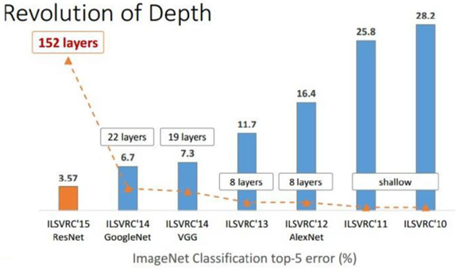

## Auxiliary classifier

아래 그림의 GoogLeNet 블락도를 보면 Auxiliary classifier라고 불리는 독특한 유닛이 있다.  

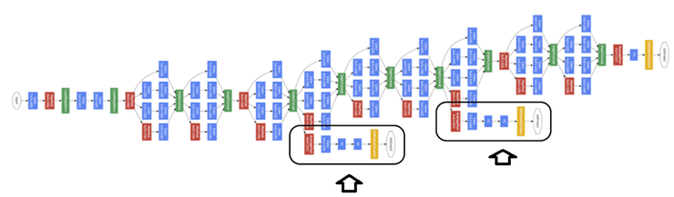  

이전의 CNN구조에서는 볼 수 없었던 독특한 구조이다.

망이 깊어지면서 생기는 큰 문제 중 하나는 vanishing gradient 문제이며,  이로 인해 학습 속도가 아주 느려지거나 overfitting 문제가 발생한다.  
신경망에서는 최종 단의 error를 역전파(back-propagation)를 시키면서 파라미터 값을 갱신한다.  그런데 gradient 값들이 0 근처로 가게 되면, 학습 속도가 아주 느려지거나 파라미터의 변화가 별로 없어 학습 결과가 더 나빠지는 현상이 발생할 수 있다.  
활성함수로 sigmoid함수를 쓰는 경우 그 특성항 일부 구간을 제외하면 미분값이 거의 0으로 수렴하기 때문에 출력 error의 크기와 상관없이 학습 속도가 느려진다. 또한 cross-entropy함수를 사용하면 좀 더 개선은 되지만 본질적인 문제가 해결이 되는 것은 아니다.  

GoogLeNet에서는 이 문제를 극복하기 위해 Auxiliary classifier를 중간 2곳에 두었다. 학습할 때는 이 Auxiliary classifier를 이용하여 vanishing gradient문제를 피하고, 수렴을 더 좋게 해주면서 학습 결과가 좋게 된다.  

이 Auxiliary classifier는 GoogLeNet 논문에 자세한 설명은 없지만, 이후 DNN을 연구하는 사람들이 이 구조에 대한 개선이나 이론적인 설명을 위한 논문을 발표 했으며, 대표적인 논문을 소개하면 다음과 같다.  

> Deeply supervised nets (C.Y. Lee, S. Xie 등)
> Training Deeper Convolutional Networks with Deep SuperVision(Liwei Wang, Chen-Yu Lee 등)  

이 중 Liewi Wang의 논문이 좀더 Auxiliary classifier에 대한 설명을 하고 있으니, 니 논문을 참고하면 도움이 될 것 같다.  

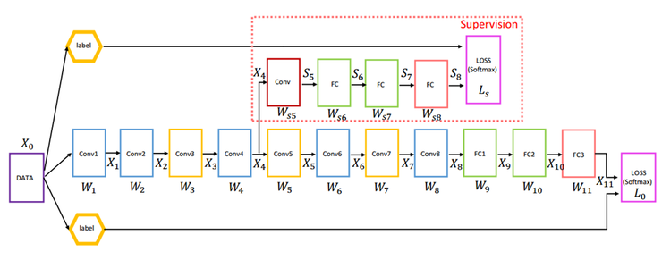 

이 그림은 Liwei Wang의 논문에 나오는 실험용 DNN의 구조이며, X4 의 위치에 그들이 SuperVision이라고 부르는 Auxiliary classifier를 배치하고, back-propergation 시에 X4 위치에서 Auxiliary classifier와 최종 출력으로부터 정상적인 back-propergation 결과를 결합시킨다.  

이렇게 되면, Auxiliary classifier의 back-propergation결과가 더해지기 때문에 X4 위치에서 gradient가 작아지는 문제를 피할 수 있다.  
GoogLeNet에서는 어느 위치에 Auxiliary classifier를 놓을 것인지, 어떤 결과를 얻었는지 명확하게 밝히지 않았지만, Liwei연구팀은 초기 10 ~ 50번 정도의 iteration을 통해 gradient가 어떻게 움직이는지 확인을 하고, 그 위치에 Auxiliary classifier를 붙이는 것이 좋다고 논문에서 밝혔다.  

이후 2015년 후반에 GoogLeNet의 첫번째 저자 Szegedy가 다시 발표한 논문 "Rethinking the inception Architecture for Computer Vision"에 다시 Auxiliary classifier에 대한 이야기가 잠깐 나오는데, 여기에 따르면, Auxiliary classifier가 "Regularizer"와 같은 역할을 하며, 최종 단의 Main classifier가 중간의 side branch에 있는 Auxiliary classifier 가 batch-normalize 되었거나 drop-out layer를 갖고 있으면 결과가 더 좋아진다는 언급이 있다.  

학습이 끝나고, 학습된 DNN을 이용할 때는 Auxiliary classifier는 삭제한다. 즉 Auxiliary classifier는 학습을 도와주기 위한 도우미 역할만을 하고, 학습을 통해 결과를 얻게 되면, 본래의 역할을 다하기 때문에 제거한다.  

## Factorizing Convolutions

큰 필터 크기를 갖는 convolution커널을 인수 분해 하면, 작은 커널 여러 개로 구성된 deep network를 만들 수 있으며, 이렇게 되면 parameter의 수가 더 줄어들면서 망은 깊어지는 효과를 얻을 수 있다.  

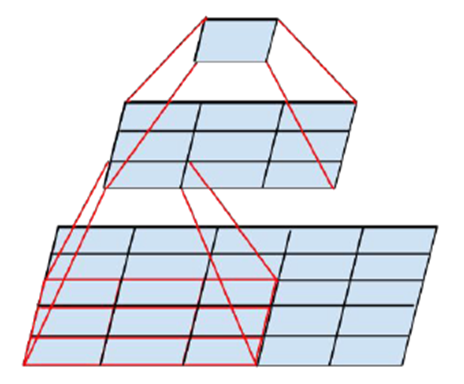

위 그림은 5x5 convolution을 2 layer의 3x3 convolution으로 구현한 경우를 보여준다.  
5x5 convolution은 3x3에 비해 더 넓은 영역에 걸쳐 특징을 한 번에 추출할 수 있지만, 25/9 = 2.78배 비싼 유닛이다.   

이 5x5 convolution은 2단의 3x3 convolution을 사용해 구현이 가능하며, 이 경우 free parameter의 수는 (9+9) 로 5x5 convolution의 25와 비교하면 28% 만큼 절감이 가능하다. 아래 그림은 이 방식을 적용하여 원래의 Inception을 변형시킨 결과이다.  

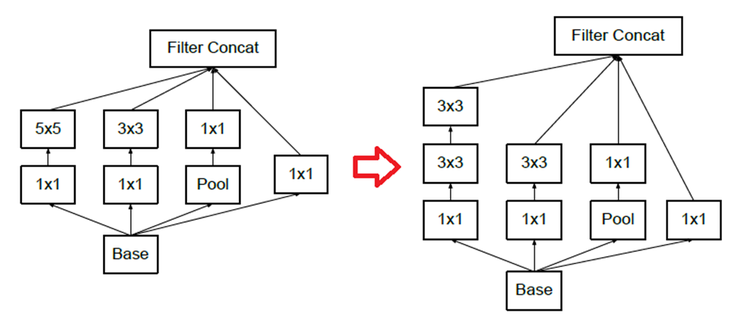

7x7 convolution의 경우도 위 경우와 마찬가지로 3단의 3x3 convolution으로 대응이 가능하며, 이 경우는 (9+9+9)=27 이 되어 49와 비교하여 45% 만큼 절감할 수 있다.  

5x5나 7x7 convolution을 여러단의 3x3 convolution과 같이 symmetry를 유지하는 방식으로의 인수분해가 가능하지만, symmety를 유지 하지 않고 row 방향 혹은 column 방향으로 인수 분해 하는 것도 가능하다. 아래 그림은 3x3 convolution을 1x3 convolution과 3x1 convolution으로 분해한 것이다.  

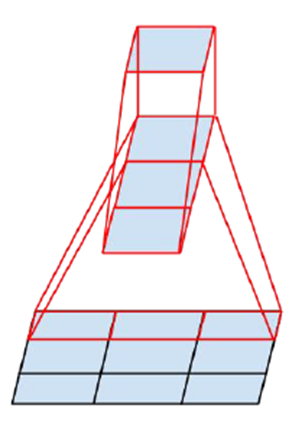

이렇게 되면, free parameter의 수는 (3+3)=6 이 되어, 9와 비교하면 33% 절감이 된다.  비슷하게 nxn convolution은 1xn 및 nx1로 분해가 가능하며, n이 클수록 파라미터 절감 효과가 커진다.  

이것을 인셉션 구조에 표현을 하면 아래 그림과 같이 된다. 아래 그림에서 n=3 이면 앞에서 살펴본 인셉션 모듈과 동일한다.  

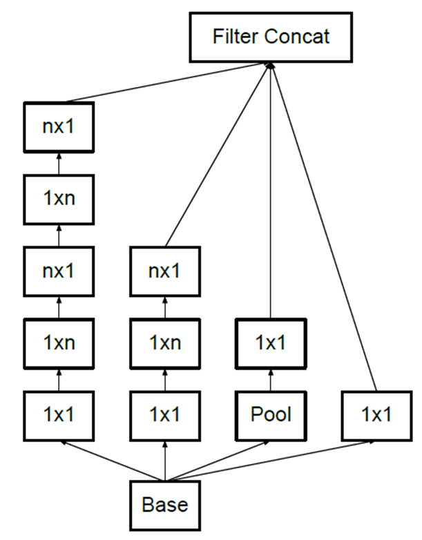

큰 필터를 균일한 크기의 3x3 으로 표현하는 것은 VGGNet의 핵심 아이디어이며, 효과적으로 grid 크기를 줄이는 기술은 구글이 자신들의 인셉션 구조를 발전시킨 Inception-V2, Inception-V3의 핵심 아이디어가 된다.  

## Convolution Neural Network

통상적인 CNN의 구조를 보면, convolution layer 뒤에 pooling layer를 두고, feature-map의 grid(해상도) 크기를 줄이는 것이 일반적이었다.  
하지만 Inception module을 보면 여러개의 convolution layer와 pooling layer가 나란히 있는 좀 독특한 모양을 볼 수 있다.  

### 효과적으로 해상도(grid size)를 줄이는 방법

앞에서도 이야기를 했듯이, grid 크기를 줄이는 대표적인 방법은 convolution을 수행할 때 stride를 1 이상의 값으로 설정하거나, pooling을 사용하는 것이다.  

전형적인 CNN구조에서는 convolution layer를 이용하여, 이전 feature-map으로부터 의미 있는 특징을 추출하며, 이 때 convolution kermel의 개수는 숨어 있는 특징을 잘 추출할 수 있도록 충분한 수가 있어야 함은 물론이다. 그리고 다음 단에 오는 pooling layer를 이용해 feature-map의 크기를 줄이는 것이 일반적인 방식이다.  

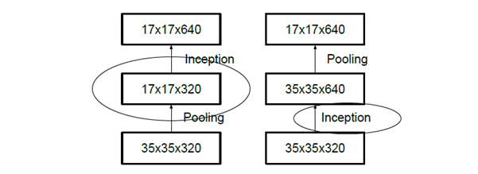

위 그림에서는 convolution 대신에 Inception으로 표시가 되어 있지만, 이것을 convolution이라고 생각을 해도 큰 차이가 없다.   
35x35 크기의 320개 feature-map을 입력으로 하여 17x17 크기의 640개의 feature-map을 얻고자 한다. 위 방식 중 어느 쪽이 효과적으로 grid 크기를 줄이는 방식일 까?  

먼저 왼쪽 방식은 35x35x320 feature-map에 먼저 pooling을 적용하여 크기를 절반으로 줄인다. 뒤에 Inception을 적용하여 17x17 크기의 640개 feature-map을 얻었다.  연상량 관점에서만 보면 이 방식이 효율적인 것처럼 보이지만, Pooling 단계를 거치면서 원래 feature-map에 있는 숨어 있는 정보(representation concept)가 사라지게 될 가능성이 있으므로 효율성 관점에서 보면 최적이라고 보기 어렵다.  
반면에 오른쪽은 Inception module을 먼저 적용하여 64개의 feature-map을 얻은 후에 pooling을 적용하여 feature-map의 크기를 줄였다.  이 경우에는 큰 크기의 feature-map에 Inception을 적용하였기 때문에 연산량의 관점에서 보면, 결과적으로 4배가 많은 셈이 된다.  
당연히 feature-map의 크기를 줄이기 전에 Inception을 적용하였기 때문에 숨은 특징을 더 잘 찾아낼 가능성은 높아진다.  

그렇다면 좀 더 효과적으로 grid 크기를 줄이는 방법은 무엇일까?  

Szededy(GoogLeNet 설계자 중 항 명)는 자신의 논문 "Rethinking the inception architecture for computer vision"에서 아래 그림과 같은 구조를 제안하였다.  

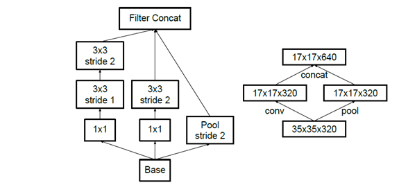 

먼저 왼쪽은 구조가 Inception module과 비슷하다는 것을 발견할 수 있을 것이다. (다른 점이 있다면, 최종단에 stride 값을 "1"이 아니라 "2"로 적용했다는 점이다.)  
Pooling layer 및 convolution layer를 나란하게 배치하고, 최종단에 stride 값을 "2"를 적용하게 되면, 결과적으로 5x5, 3x3 convolution을 통해 local feature를 추출하면서 stride 2를 통해 크기가 줄고, 또한 pooling layer를 통해서도 크기를 줄이고 그 걸과를 결합하는 방식이다.  

오른쪽은 왼쪽보다는 좀 더 단순한 방법으로 stride 2ㄹㄹ 갖는 convolution을 통해 320개의 feature-map을 추출하고 pooling layer를 통해 다시 320개의 feature-map을 추출함으로써 효율성과 연상량의 절감을 동시에 달성할 수 있게 되었다.  

## Inception-V2  

2014년 ILSVRC를 참가할 당시에는 구글은 전년도 ZFNet의 결과보다 거의 2배 정도의 성능을 얻었기 때문에, 그리고 사람들이 식별할 수 있는 수준에 육박했기 때문에 Inception-V1 구조에 만족하였을 것 같다.  
하지만, 불과 1년 후 2015 ILSVRC에서 마이크로소프트의 ResNet이 GoogLeNet결과보다 거의 2배 좋은 성능으로 우승을 한다. 그 결과 Inception-V2 및 V3가 되었으며, 하마 지금은 더 성능을 올리는 방법에 대한 체계적인 연구를 하고 있을 것으로 추정된다.  

2014년에 발표한 VGGNet은 GoogLeNet과 거의 유사한 성능을 보이면서, 구조도 3x3 convolution만을 사용하는 단순한 구조로 유명하다. 여기에 많은 힌트를 얻을 것으로 보이며, colvolution kernel에 대한 인수분해를 통해 망은 더 깊어지게 되고, 효과적으로 연산량은 더 절감할 수 있게 된다.  

18-layer의 VGGNet이 22-layer의 GoogLeNet보다 연산량이 3배 가량 많았기 때문에, 구글의 설계 철학과 맞지 않아 그들의 방식을 단순하게 따르지 않았고, 단지 인수분해의 개념만을 따왔다. 본래의 Inception module을 인수분해 방식을 사용하여 좀 더 개선하고, GoogLeNet 앞단에 있던 7x7 convolution등을 인수분해를 통해 작은 크기의 multi-layer 구조로 개선하였다.   
아래 표는 Inception-V2의 layer 구조를 보여주는 표이다.  

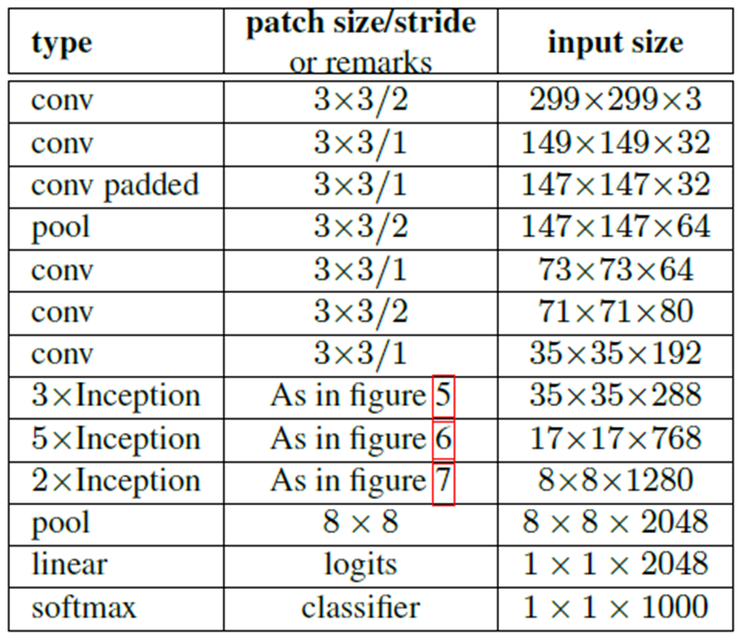  

2014년 GoogLeNet에서는 입력 이미지로 224x224x3 크기를 지원했지만,  2015년 Inception-V2 사용한 구조에서는 입력 이미지를 229x229x3의 크기를 지원할 수 있도록 하였다.  

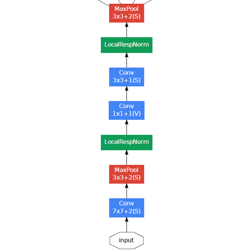  

맨 앞 단은 stride 2값을 적용한 7x7 convolution 뒤에 max-pooling을 적용하여 이미지의 크기가 다시 1/4로 줄어들게 되어 56x56x64가 된다. 다음 단에서 1x1 convolution 및  3x3 convolution, max-pooling을 통해 인셉션 모듈의 입력으로는 28x28x192 크기가 적용이 된다.  

하지만, Inception-V2를 적용한 2015년 구조에서는 7x7 convolution은 3개의 3x3 convolution으로 layer가 더 깊어지게 되었으며 Pooling을 통해 73x73x64 크기의 featuer-map이 얻어지게 된다.  

다음은 3개의 convolution을 통해 최종적으로 35x35x228 이미지가 얻어지게 된다. 2014년 구조에서는 1x1 convolution, 3x3 convolution, max-pooling을 거쳤지만, 2015년 구조는 3개의 convolution으로 구현을 하였고, 중간 과정에 stride 2를 적용하여 pooling의 효과를 얻을 수 있도록 하였다.  

다음 단에는 인셉션 모듈을 적용하는 것은 비슷하나, 맨 앞단의 인셉션 모듈의 개수가 2개에서 3개로 늘어났으며, 적용하는 인셉션 모듈의 구조도 위에서 살펴본 구조로 치환이 되어 망이 더 깊어지면서 연산량은 절감할 수 있게 되었다.  최종단의 구조도 2014년 구조와 비슷하기는 하지만 feature-map의 개수가 좀 더 많아졌다는 점이 다르다.  

이런 구조 변화를 통해 22개의 layer를 갖던 2014년 구조에 비해, 총 42개의 layer로 깊러지게 되었지만, 연산량은 2.5배 늘어난 수준으로 여전히 높은 효율성을 보인다.  

그 결과는 아래 표와 같다.  
아래 표에서 GoogLeNet의 결과가 원래 결과보다 높게 보이는 이유는 data augmentation 기법을 적용하지 않고 single-crop을 했을 때의 결과이다.  

아래 Inception-V2를 다양하게 적용했을 때의 결과이며, regulatization 효과를 극대화 시키기 위해 batch-normalized aucillaty classifier를 적용한면, 성능이 5.6%까지 좋아진다는 것을 확인할 수 있다.  

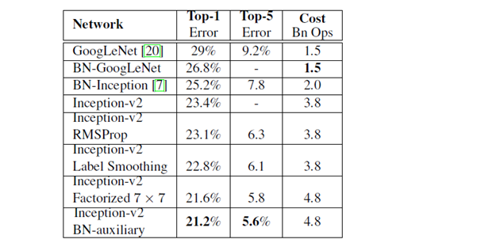 

Multi-crop을 144개 까지 적용하고, Inception-V2의 성능을 더 극대화 시킨 Inception-V3 구조에서는 top-5 error율이 4.1 까지 떨어져 아주 우수한 성능을 보이게 된다.  

---

> 효과적으로 Grid size를 줄이는 방법을 살펴보았는데, 단순하게 pooling layer를 적용하는 것보다 convolution layer와 같이 나란히 적용하는 것이 효과적이라는 것을 파악하였다.  

<h2>Refernece </h2>  

[라온피플 블로그](http://laonple.blog.me/220643128255)