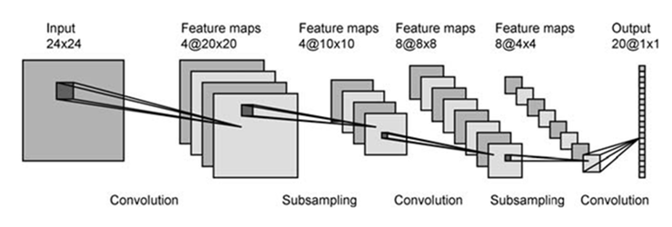
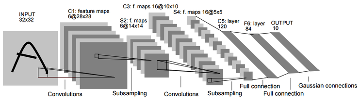

Convolutaion Neural Networks
=====================================
> 2017.07.25.  
> CNN 정리노트 2

<!-- TOC -->

- [LeNet](#lenet)
- [LeNet-1 의 구조](#lenet-1-의-구조)
- [LeNet-5 의 구조](#lenet-5-의-구조)

<!-- /TOC -->
---

## LeNet

Convolutional neural network라는 개념을 최초로 개발한 사람은 프랑스 출신의 Yann LeCun이며, 그는 현재 뉴욕대 교수와 Facebook 인공 지능 연구소의 기술이사를 겸하고 있다. 원래 우편번호와 수표의 필기체를 인식하기 위한 용도로 개발을 시작했으며, 그 연구 그룹이 최종적으로 발표한 구조가 바로 유명한 LeNet5 이다.

> Convolutional Neural Network의 古典

Yann LeCun과 그의 동료 연구원들은 기존의 fully-connected neural network이 갖고 있는 한계를 잘 이해하고 있었으며, 이것들을 개선하기 위한 연구에 돌입했다.

기존 신경망의 문제점은 이미 class19를 통해 살펴보았듯이, fully-connected neural network이 machine learning에 손색이 없는 알고리즘이기는 하지만, topology 변화에 대응이 어렵다는 점이다.

이 연구진들은 class20과 class21에서 살펴보았던 것처럼, local receptive field, shared weight 및 sub-sampling의 개념을 결합한 CNN(Convolutional Neural Network)의 개념을 개발하게 된다.  
그들이 최초로 개발한 LeNet-1은 1990년에 발표하게 되는데, 이것이 LeNet-5의 前身(전신)이라고 볼 수 있으며, 크기가 작을 뿐이지 현재 LeNet-5의 모습을 거의  갖추고 있음을 알 수 있다. (아래 그림 참고)  

## LeNet-1 의 구조

type        |patch size/stride  |   ouput size  | 비고
:-----------|:-----------------:|:-------------:|:-------------
input       |                   |   28x28x1     | 손글씨 (주로 필기체)
conv1       |   5x5/1           |   24x24x4     |
pooling1    |   2x2/2           |   12x12x4     | average 사용
conv2       |   5x5/1           |   8x8x12      |
pooling2    |   2x2/2           |   4x4x12      | average 사용
FC          |   192             |   10          | 4x4x12 = 192

이들은 이 구조를 완성하고 비교를 통해, fully-connected network나 기타 다른 machine learning 알고리즘을 적용하는 것보다 훨씬 결과가 좋다는 사실에 고무되어, 이 구조를 점차 발전시키게 된다.  
이후 이 연구 그룹은 현재의 LeNet-5와 구조적으로 훨씬 유사한 LeNet-4를 거쳐, 최종적으로 LeNet-5를 발표하기에 이른다.
   
## LeNet-5 의 구조

type        |patch size/stride  |   ouput size  | 비고
:-----------|:-----------------:|:-------------:|:-------------
input       |                   |   32x32x1     | 단일 chanel
conv1       |   5x5/1           |   28x28x6     |
pooling1    |   2x2/2           |   14x14x6     | average 사용
conv2       |   5x5/1           |   10x10x16    |
pooling2    |   2x2/2           |   5x5x16      | average 사용
conv3       |   5x5/1           |   1x1x120     | 1x1 크기의 feature-map
FC1         |   120             |   84          | 
FC2         |   84              |   10          |

---

<h2>Refernece </h2>  

[라온피플 블로그](http://laonple.blog.me/220643128255)