Convolutaion Neural Networks
=====================================
> 2017.08.25.  
> CNN 정리노트 6

<!-- TOC -->

- [ResNet](#resnet)
- [ResNet 팀의 실험](#resnet-팀의-실험)
    - [실험 결과](#실험-결과)
    - [Deeper Bottleneck Architecture](#deeper-bottleneck-architecture)
- [CIFAR](#cifar)
- [진행중..](#진행중)

<!-- /TOC -->
---

## ResNet  

ResNet 설계 팀은 망을 100 layer 이상으로 깊게 하면서, 깊이에 따른 학습 효과를 얻을 수 있는 방법을 고민하였으며, 그 방법으로 `Residual Learning`이라는 방법을 발표하였다. Residual이라는 단어를 사용한 이유는 아래 구조를 살펴보면 파악할 수 있다.  

먼저 아래 구조와 같은 평범한 CNN 망을 살펴보자. 이 평범한 망은 입력 x를 받아 2개의 weighted layer를 거쳐 출력 `H(x)`를 내며, 학습을 통해 최적의 H(x)를 얻는 것이 목표이며, weight layer의 파라미터 값은 그렇게 결정이 되어야 한다.  

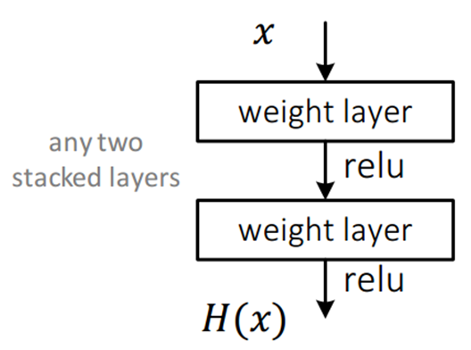  

그런데 위 네트워크에서 H(x)를 얻는 것이 목표가 아니라 `H(x) - x`를 얻도록 학습이 되어야 한다. 여기서 F(x) = H(x) -x 라면, 결과적으로 출력 `H(x) = F(x) + x` 가 된다.  

그러므로 위 블럭은 아래 그림처럼 바뀌며, 이것이 바로 Residual Learning의 기본 블럭이 된다.  달라진 점이 있다면 , 입력에서 바로 출력으로 연결되는 `shortcut` 연결이 생기게 되었으며, 이 shortcut은 파라미터가 없이 바로 연결이 되는 구조이기 때문에 연산량 관점에서는 덧셈이 추가되는 것 외에는 차이가 없다.  

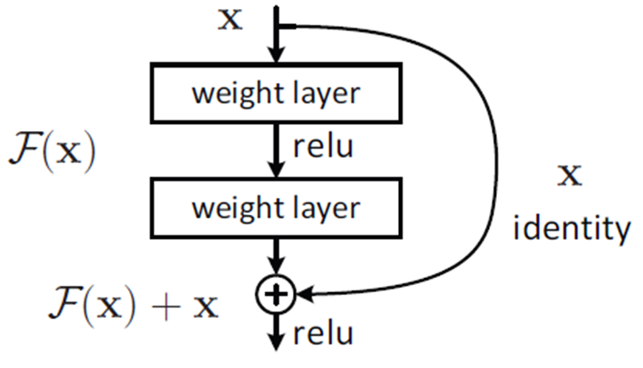  

이렇게 관점을 조금 바꿨을 뿐이지만, 꽤 많은 효과를 얻을 수 있다. 예전에는 H(x)를 얻기 위한 학습을 했다면, 이제는 H(x) - x 를 얻기위한 학습을 하게 되며, 최적의 경우라면 F(x)는 0이 되어야 하기 때문에 학습할 방향이 미리 결정이 되어, 이것이 pre-conditioning 구실을 하게 된다. F(x)가 거의 0이 되는 방향으로 학습을 하게 되면 입력의 작은 움직임(fluctuation)을 쉽게 검출할 수 있게 된다. 그런 의미에서 F(x)가 작은 움직임, 즉 나머지(residual)를 학습한다는 관점에서 residual learning이라고 불리게 된다.  

## ResNet 팀의 실험  

ResNet 팀은 실험을 위한 망을 설계하면서 VGGNet의 설계 철학을 많이 이용하였다. 그래서 대부분의 convolution layer는 3x3 kernel을 갖도록 하였으며, 다음 2가지 원칙을 지켰다.   
1. 출력 feaure-map 크기가 같은 경우, 해당 모든 layer는 모두 동일한 수의 filter를 갖는다.  
2. Feature-map의 크기가 절반으로 작아지는 경우는 연산량의 균형을 맞추기 위해 필터의 수를 두 배로 늘린다.  
Feature-map의 크기를 줄일 때는 pooling을 사용하는 대신에 convolution을 수행할 때, stride의 크기를 `2` 로 한다.  
또한 복잡도를 줄이기 위해 `Fullu-connected`, `Deopout` 등을 사용하지 않았다.  
이들은 비교를 위해 평범한(plain) 망과 residual network으로 구별을 하였다. Plain network의 경우도 VGGNet보다 filter의 수를 줄이고 복잡도를 낮춤으로써 34-layer의 plain network이 19-layer의 VGGNet에 비해 연산량을 20% 미만으로 줄였다.  
* VGGNet-19 : 19.6M
* ResNet-34 : 3.6M (plain)  

Residual network도 구조를 간단하게 하기 위해, 매 2개의 convolution layer마다 shortcut connection이 연결되도록 하였다.  

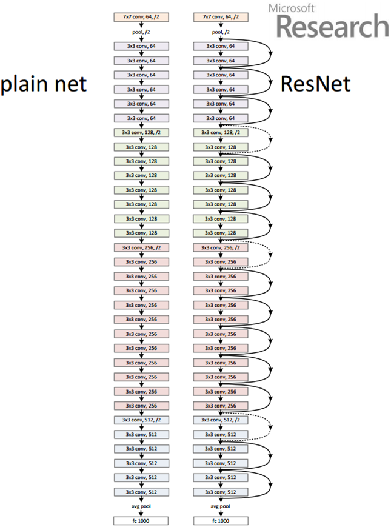  

또한 실험에는 18-layer, 34-layer, 50-layer, 101-layer 및 152-layer에 대하여 수행을 하였으며, 각각에 대한 layer 구성은 다음 표와 같다.  

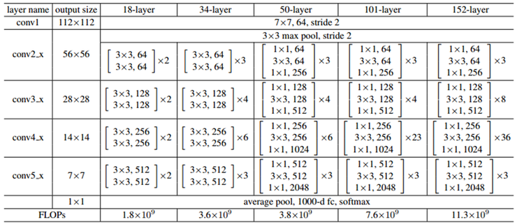  

위 표를 보면 18-layer와 34-layer가 동일한 구조를 가졌고, 50-layer, 101-layer 와 152-layer가 동일한 구조를 가진것을 알 수 있다.  

### 실험 결과  

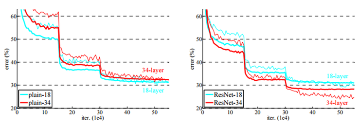  

먼저 실험 18-layer와 34-layer에 대한 Plain 과 Residual network의 실험 결과를 보면 다음과 같다.  

Plain의 경우는 34-layer의 결과가 18-layer의 결과보다 약간 나쁘다는 것을 알 수 있으며, Residual의 경우 34-layer가 18-layer의 결과보다 좋은 것을 알 수 있다.  

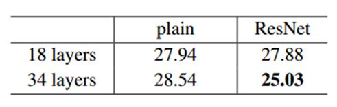  

또 한가지 주목할 점은 학습 초기 단계에서 residual network의 수렴속도가 plain network보다 빠르다는 점이다.  

### Deeper Bottleneck Architecture  

학습에 걸리는 시간을 고려하여 50/101/152-layer에 대해서는 기본 구조를 조금 변경시켰으며, residual function은 1x1, 3x3, 1x1으로 아래 그림처럼 구성이 된다. Bottleneck 구조라고 이름을 붙인 이유는 차원을 줄였다가 뒤에서 차월을 늘리는 모습이 병목처럼 보이기 때문이라고 생각된다.  

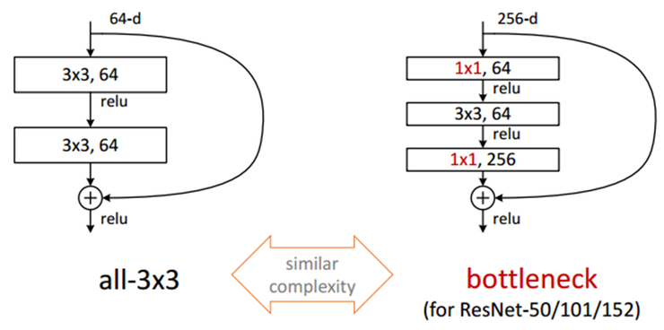  

이렇게 구성한 이유는 연산 시간을 줄이기 위함이다. 먼저 맨 처음 1x1 convolution은 NiN이나 Inception구조에서 살펴본 것처럼 dimension을 줄이기 위한 목적이며, 이렇게 dimension을 줄인 뒤 3x3convolution을 수행한 후, 마지막 1x1convolution은 다시 dimension을 확대시키는 역할을 한다. 결과적으로 3x3convolution 2개를 곧바로 연결시킨 구조에 비해 연산량을 절감시킬 수 있게 된다.  

Single model에 대한 실험 결과는 아래 표와 같다. 152-layer에 대한 top-5 error율은 4.49% 수준까지 떨어졌다. Single model 만으로도 과거에 발표된 어떤 구조보다도 좋은 결과를 얻을 수 있었다.  

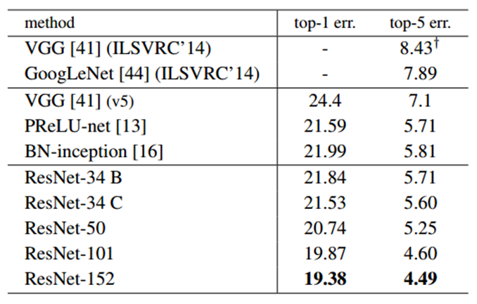  

최족적으로 ILSVRC에 제출한 결과는 아래와 같다. 당시에는 2개의 152-layer 결과를 조합해서 얻은 결과를 제출하였다.

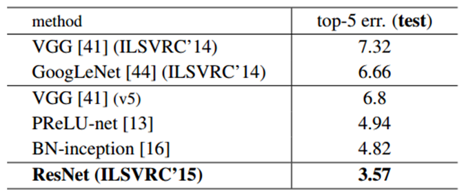  

## CIFAR  

CIFAR-10은 32x32 크기의 작은 영상 데이터들의 집합이며, train 이미지 5만장과 test 이미지 1만장으로 구성되어 있다. 총 10개의 class가 있으며, 각각의 class에는 학습과 검사 영상을 합해 총 6000장이 있다.  

ResNet 팀은 CIFAR-10에 대한 검증을 위해 망 구성을 약간 변형을 시켰다. 그 이유는 ILSVRC 데이터의 경우 224x224 크기였지만 CIFAR-10의 이미지 크기가 작기 때문이다. 검증 방식은 동일한 layer 수를 갖는 Plain과 Residual network을 비교 실험하는 것이다.  

ImageNet 데이터를 이용한 실험에서는 맨 처음 convolution layer에 7x7 kernel 사이즈를 사용했지만, CIFAR-10의 영상은 크기가 매우 작기 때문에, 맨 처음 convolution layer에 3x3 kernel을 썼다.  

다음은 6n의 3x3 convolution layer 그룹이 온다.  6n 중 각각의 2n에 대하여 feature map의 크기가 (32, 16, 8)이 되도록 하였으며, filter의 개수는 연산량의 균형을 맞춰주기 위해 (16, 32, 64)가 되도록 하였다.  

맨 마지막에 global average pooling과 10-way softmax를 배치하였으며, 결과적으로 전체 layer의 수는 `6n + 2`가 되었다.  

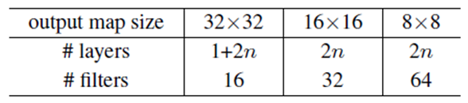  

전체적인 블락의 구성은 아래 그림과 같다.  이 그림은 개념적 이해를 돕기 위해 간단하게 14-layer를 갖는 구조만을 보여주는 것이며, layer수가 많아지면 각각의 2n 그룸에 layer를 추가하면 된다.  실제로 ResNet팀은 실험 시 n값을 바꿔가면서 더 깊은 layer에서 어떤 결과가 나타나는지 비교 실험을 하였다.  

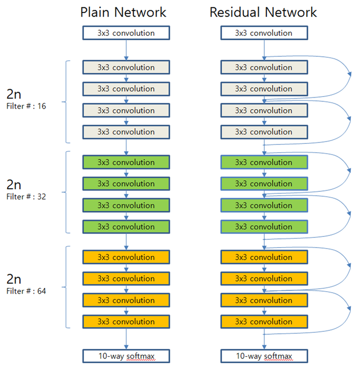  

n = (3, 5, 7, 9)로 설정을 하면 20/32/44/56-layer를 얻을 수 있으며, 이것들레 대한 실험 결과는 다음 그림과 같다. ImageNet데이터를 이용한 실험과 거의 동일한 양상의 결과를 보여준다.  
Plain망은 일정 layer수가 넘어가면 layer수가 증가함에 따라 결과가 더 나빠지는 경향성을 보이지만, Residual망은 layer수가 증가하더라고 결과가 더 좋아짐을 알 수 있다. 특히 Residual망에 대해서는 n=18로 설정하여 101-layer까지 실험을 하였는데 56-layer 때에 비해 성능이 더 좋아지는 것을 확인할 수 있다.  

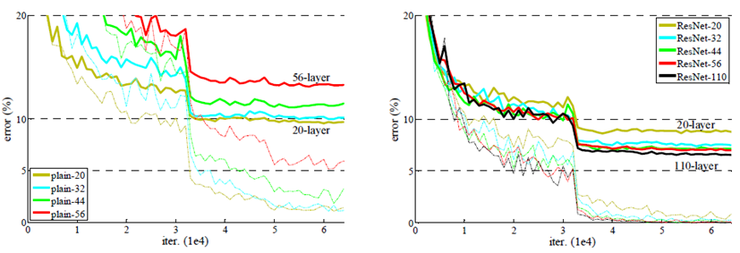  

## 진행중..

<h2>Refernece </h2>  

[라온피플 블로그](http://laonple.blog.me/220643128255)