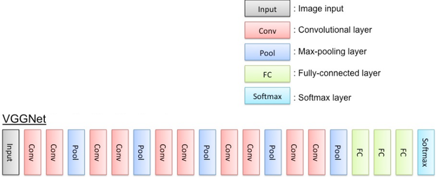
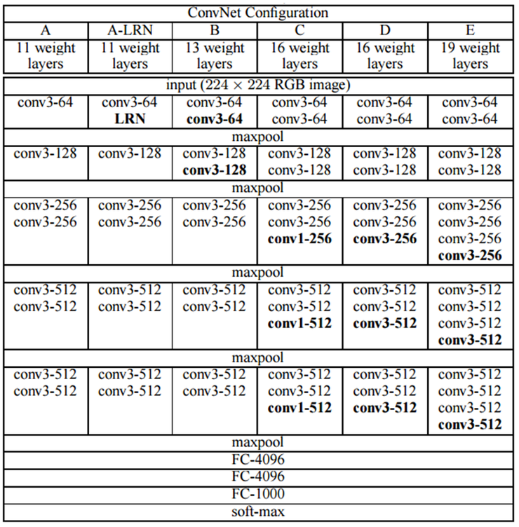
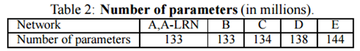
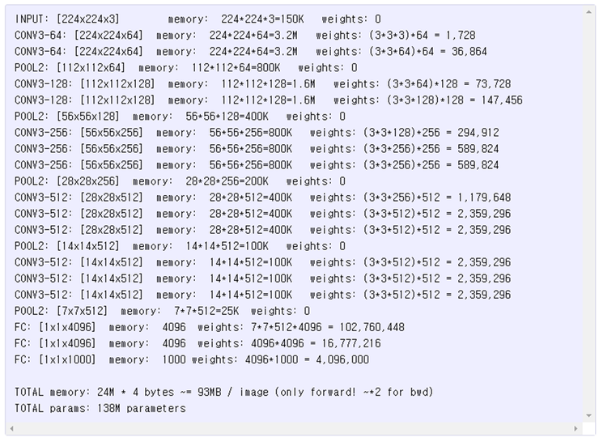
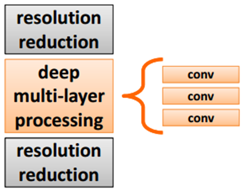
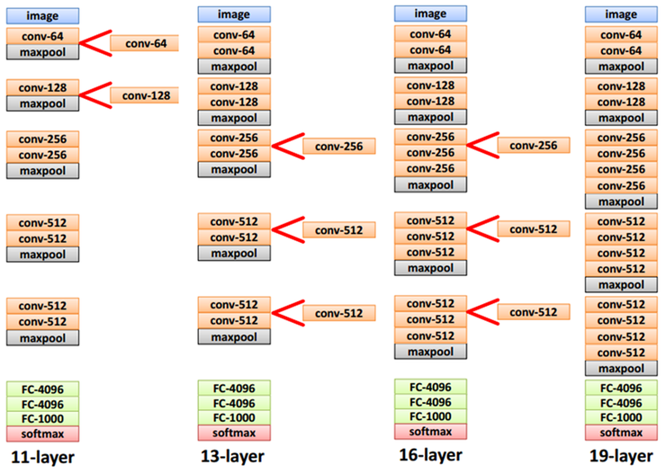
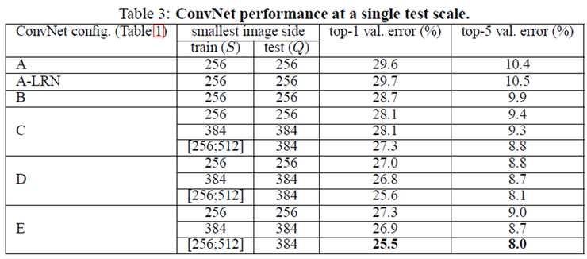
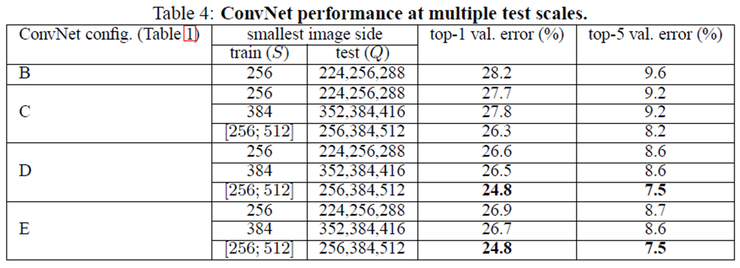
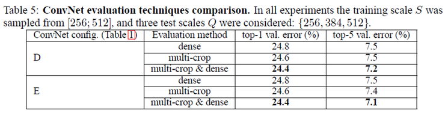

Convolutaion Neural Networks
=====================================
> 2017.08.25.  
> CNN 정리노트 5

<!-- TOC -->

- [VGGNet](#vggnet)
- [VGGNet에서 특이한 점](#vggnet에서-특이한-점)
- [깊은 망](#깊은-망)
- [VGGNet에서 성능을 높이기 위해 적용한 방법](#vggnet에서-성능을-높이기-위해-적용한-방법)
    - [Traing](#traing)
    - [Test](#test)
- [VGGNet의 결과](#vggnet의-결과)

<!-- /TOC -->
---

2014년 ILSVRC에서 GoogLeNet과 함께 큰 주목을 받은 팀은 Oxford 대학의 VGGNet 팀이다. 아마 GoogLeNet이 없었다면 모든 영광을 차지할수도 있었겠지만, GoogLeNet에 근소한 차이로 뒤지며 2위를 차지한다.  

2015년 GoogLeNet이 첫번째 저자 Szegedy가 발표한 논문 "Rethinking the Inception Architecture for Computer Vision"의 introduction 부분을 보면, 자신들의 구조가 뛰어남에도 불구하고 VGGNet이 더 많이 쓰이는 것에 대한 아쉬움(?)을 표현하고 있으며, 더 개선된 구조임을 다시 밝힌다.  

## VGGNet

VGGNet 연구팀이 그들의 논문 "Very deep convolutional networks for large-scale image recognition"에서 밝혔듯이, 원래 망의 깊이(depth)가 어떤 영향을 주는지 연구를 하기 위해 VGGNet을 개발한 것 같다.  

오직 깊이가 어떤 영향을 주는지 밝히기 위해, recptive field의 크기는 가장 간단한 3x3으로 정하고 깊이가 어떤 영향을 주는지 6개 구조에 대하여 실험을 한다.  

여기서 주목할 점은, 3x3 kernel을 사용하면 5x5, 7x7 혹은 그 이상의 크기를 갖는 convolution을 인수분해하여 깊이는 깊어지지만 파라미터 수는 줄여서 표현할 수 있다는 것이다.  

  

VGGNet은 AlexNet처럼, 224x224크기의 color이미지를 입력으로 받아들이도록 하였으며, 1개 혹은 그 이상의 convolutional layer 뒤에 max-polling layer가 오는 단순한 구조로 되어 있다. 또한 기존 CNN 구조처럼, 맨 마지막 단에는 fully-connected layer가 온다.  

VGGNet의 단점은 GoogLeNet 저자 Szegedy가 비판을 했던 것처럼, 파라미터의 개수가 너무 많다는 점이다. 아래 표를 보면 알 수 있듯이, GoogLeNet의 파라미터의 개수가 5M 수준이었던 것에 비해 VGGNet은 가장 단순한 A-구조에서도 파라미터의 개수가 133M으로 엄청나게 많다.  

  

그 결정적인 이유는 VGGNet의 경우 AlexNet과 마찬가지로 최종단에 fully-conneted layer 3개가 오는데 이 부분에서만 파라미터의 개수가 약 122M개가 온다. 참고로 GoogLeNet은 Fully-connected layer가 없다.  

아래 표는 VGGNet-16 (D-구조) 에서 필요한 파라미터의 메모리 소요량을 정리한 것이다.  

  

## VGGNet에서 특이한 점  

VGGNet은 몇가지 특이한 점이 있다.  

1. VGGNet에서 A-LRN은 Local Response Nomalization이 적용된 구조인데, 예상과 달리 VGGNet구조에서는 LRN이 별 효과가 없어 사용하지 않는다.  
2. 1x1이 적용되기는 하지만, 적용하는 목적이 GoogLeNet이나 NiN의 경우처럼 차원을 줄이기 위한 목적이 아니라 차원은 그대로 유지하면서 ReLU를 이용하여 추가적인 non-liearity를 확보하기 위함이다.  
3. Deep net은 학습할 때 vanishing/expolding gradient 문제로 학습이 어려워질 수 있는데, 이것을 먼저 11-layer의 비교적 간단한 A-구조를 학습시킨 후 더 깊은 나머지 구조를 학습할 때는 처음 4 layer와 마지막 fully-connected layer의 경우는 A-구조를 학습 결과로 초기값을 설정한 수 학습을 시켜 이 문제를 해결하였다.  

VGGNet은 동일하게 3x3 convolution kernel을 사용하는 간단한 구조를 적용하였음에도 불구하고 놀랄만한 성능을 얻었다.  

## 깊은 망  

VGGNet 팀은 깊은 망의 독특한 구조를 설계하는 것이 목적이 아니라, 망의 깊이가 어떤 영향을 끼치는지를 확인하기 위해 가장 단순한 구조인 3x3 convolution layer를 겹쳐서 사용하는 방법을 취했으며, 여러 개의 구조 실험을 통해, 어느 정도 이상이 되면 성능 개선의 효과가 미미해지는 지점이 있음을 확인했다. (몇 개의 layer가 최적인지는 학습 데이터의 수나 해결하고자 하는 문제의 성격에 따라 달라질 수 있다.)  

VGGNet의 기본 개념은 다음 그림과 같다. CNN의 기본 구조가 convolution layer 다음에 해상도를 줄이기 위한 pooling layer가 오는 구조인다, 여기서 노란색 부분에 receptive field의 크기가 3x3인 filter를 여러 개 stack하는 구조를 선택했다.  

  

이렇게 3x3 convolution layer를 2개 싸으면 5x5 convolution이 되고, 3개를 쌓으면 7x7 convolution이 된다. 그리고 덤으로 얻을 수 있는 효과는 파라미터의 수가 줄어들고, 그로 인해 학습의 속도가 빨라진다는 점이다.  또한 layer 수가 많아질수록 non-linearity가 더 증가하기 때문에 좀 더 유용한 feature를 추출하기에 좋다. 그래서 실제로 5x5 convolution 1개로 구현하는 것 보다는 3x3 convolution 2개로 구현하는 편이 결과가 더 좋다.  

아래 그림처럼 11-layer 의 구조에서 중간에 화살표의 위치에 convolution layer를 추가하여 13-layer 구조로 만들고, 다시 convolution layer를 추가하여 16-layer 구조로 발전시켰으며, 같은 방식으로 19-layer 까지  발전된다.  

  

망이 깊어지면 vanishing/exploding gradient의 문제로 인해 학습에 어려움이 생기는데, 이 문제를 해결하기 위해 VGGNet은 11-layer 구조의 학습 결과를 더 깊은 layer의 파라미터 초기화 시에 이용함으로써 학습의 시간을 줄이고, vanishing gradient 문제도 해결하였다.  

##  VGGNet에서 성능을 높이기 위해 적용한 방법  

VGGNet 팀은 3x3 convolution이라는 단순한 구조로부터 성능을 끌어내기 위해, Traing과 Test에 많은 공을 들였으며, 다양한 경우에 성능이 어떻게 달라지는지 공개하여 CNN 구조 이해에 많은 기여를 하였다.  

### Traing  

ILSVRC-2012에는 1000개의 class가 있으며, 각각의 class에는 약 1000장 정도의 학습 이미지가 있다. Class 당 1000장의 학습 데이터라면 결코 많다고 볼 수 없으며, overfitting에 빠지지 않도록 학습 방법을 잘 설정해줘야 한다. 이 때 흔히 사용하는 방법이 지능적으로 학습 데이터의 양을 늘리기 위한 data augmentation 기법이다.  

AlexNet은 모든 학습 이미지를 256x256크기로 만든 후, 거기서 무작위로 224x224크기의 이미지를 취하는 방식으로 학습 데이터의 크기를 2048크기로 늘렸으며, RGB color를 PCA를 사용해 데이터를 조작하는 방식도 사용하였다.  하지만 AlexNet에서 모든 이미지를 256x256 크기의 single scale 만을 사용하였다.  

반면에 GoogLeNet은 영상의 가로/세로 비를 3:4, 4:3 범위를 유지하면서 원 영상의 8% 부터 100% 까지 포함할 수 있도록 하여 다양한 크기의 patch를 학습에 사용하였다. 또한 photometric distortion을 통해 학습 데이터를 늘렸다.  

VGGNet에서는 training scale을 'S'로 표시하며, single-scale training과 multi-scaling traning을 지원한다. Single-scale에서는 AlexNet과 마찬가지로 S = 256 으로 고정시키는 경우와 S = 256 과 S = 384 두개의 scale을 지원한다.  
multi-scale의 경우는 S를 Smin과 Smax범위에서 무작위로 선택할 수 있게 하였으며, Smin은 256이고 Smax는 512이다. 즉, 256과 512범위에서 무작위로 scale을 정할 수 있기 때문에 크기에 대응이 가능하여 정확도가 올라간다. Multi-scale 학습은 S = 384로 미리 학습 시킨 후 S를 무작위로 선택해가며 fine tuning을 한다. S를 무작위로 바꿔 가면서 학습을 시킨다고 하여, 이것을 `scale jittering`이라고 하였다.  

### Test 

Test는 학습된 신경망에서 최적의 결과를 도출해내는 것이 목적이며, 대부분 학습 이미지로부터 여러 개의 patch 혹은 crop을 이용하여, 가능한 많은 test 영상을 만들어 낸 후 여러 영상으로부터의 결과를 voting을 통해 가장 기대되는 것을 최종 test 결과로 정한다. 역시 마찬가지로 AlexNet, GoogLeNet과 비교를 통해 VGGNet 설계팀이 어떤 노력을 했는지 확인해 보자.  

* AlexNet은 Test 영상을 256x256 크기로 scaling 하고, 그 영상을 4코너와 중앙에서 224x224 크기의 영상을 잘라 5개의 영상을 만들고, 이것을 좌우 반전시켜 총 10장의 Test 영상을 만들어 냈다. 10장의 테스트 영상을 망에 집어넣고 10개의 결과를 평균하는 방식으로 최종 출력을 정했다.  

* GoogLeNet의 경우는 테스트 영상을 256x256 1개의 scale만 사용하는 것이 아니라, (256, 288, 320, 352)로 총 4개의 scale로 만들고 각각의 scale로 부터 3장의 정사각형 이미지를 선택하고, 다시 선택된 이미지로부터 4개의 코너 및 센터 2개를 취해 총 6장의 224x224 크기의 영상을 취하고, 각각을 좌우반전 시키면 `4x3x6x2 = 144`개의 Test 영상을 만들어 냈다. 결과에 대해서는 AlexNet과 마찬가지로 voting을 사용했다.  

* VGGNet은 'Q'라고 부르는 test scale을 사용하며, 테스트 영상을 미리 정한 크기 Q로 크기조절을 한다. Q는 training scale S와 같을 필요가 없으며, 당연한 이야기이겠지만, 각각의 S에 대해 여러개의 Q를 사용하게 되면 학습의 결과는 좋아진다.  
VGGNet의 경우 GoogLeNet과 같은 multi-crop 방식의 150장 테스트 영상을 augmentation 방법을 적용하기도 했지만, 연산량을 줄이기 위해 OverFeat구조( OverFeat: Integrated Recognition, Localizaion and Detection using Convolution Networks ) 에서 사용한 `dense evaluation`개념을 적용하였다. 최종적으로는 성능을 더 끌어올리기 위해, multi-crop 방식과 dens evaluation 개념을 섞어 사용하였다.  

## VGGNet의 결과  

VGGNet에 single-scale test영상을 적용했을 때의 결과는 아래 표와 같다. 망이 깊어질수록 결과가 좋아지고, 학습에 scale jittering을 사용한 경우에 결과가 더 좋아진다는 것을 확인할 수 있다.  

  

Multi-scale tet결과는 아래 표와 같다. S가 고정된 경우는 (S-32, S, S+32)로 Q 값을 변화 시키면서 Test를 했다. 여기서 학습의 scale과 Test의 scale이 많이 차이가 나는 경우는 오히려 결과가 더 좋지 못해 32만큼 차이가 나게 하여 Test를 했다.  

학습에 scale jittering을 적용한 경우는 출력의 크기는 [256, 384, 512]로 Test 영상의 크기를 정했으며, 예상처럼 scale jittering을 적용하지 않은 것보다 훨씬 결과가 좋고, single-scale 보다는 multi-scale이 결과가 좋다는 것을 확인할 수 있다.  

  

  

<h2>Refernece </h2>  

[라온피플 블로그](http://laonple.blog.me/220643128255)